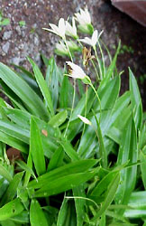

# [[Pandanales]] 

 

## #has_/text_of_/abstract 

> **Pandanales**, the pandans or screw-pines, is an order of flowering plants 
> placed in the monocot clade in the Angiosperm Phylogeny Group 
> and Angiosperm Phylogeny Web systems. 
> 
> Within the monocots Pandanales are grouped in the lilioid monocots 
> where they are in a sister group relationship with the Dioscoreales. 
> 
> Historically the order has consisted of a number of different families in different systems 
> but modern classification of the order is based primarily on molecular phylogenetics 
> despite diverse morphology which previously placed many of the families in other groupings 
> based on apparent similarity. 
> 
> Members of the order have a subtropical distribution 
> and includes trees, shrubs, and vines as well as herbaceous plants. 
> The order consists of 5 families, 36 genera and about 1,610 species.
>
> [Wikipedia](https://en.wikipedia.org/wiki/Pandanales) 

## Phylogeny 

-   « Ancestral Groups  
    -   [Monocot](../Monocot.md)
    -   [Flowering_Plant](../../Flowering_Plant.md)
    -   [Seed_Plant](../../../Seed_Plant.md)
    -   [Land_Plant](../../../../Land_Plant.md)
    -   [Green plants](../../../../../Plants.md)
    -   [Eukaryotes](Eukaryotes)
    -   [Tree of Life](../../../../../../Tree_of_Life.md)

-   ◊ Sibling Groups of  Monocotyledons
    -   [Alismatanae](Alismatanae.md)
    -   [Aranae](Aranae.md)
    -   [Liliales](Liliales.md)
    -   [Asparagales](Asparagales.md)
    -   Pandanales
    -   [Dioscoreales](Dioscoreales.md)
    -   [Palms](Palms.md)
    -   [Zingiberanae](Zingiberanae.md)
    -   [Commelinanae](Commelinanae.md)

-   » Sub-Groups 
	-   *Cyclanthaceae*
	-   *Pandanaceae*
	-   *Stemonaceae*
	-   *Triuridaceae*
	-   *Velloziaceae*

## Title Illustrations

---------------------------------------------------------------------
 
Scientific Name ::  Barbacenia elegans
Comments          Velloziaceae
Copyright ::         © [Kurt Stüber](http://www.biolib.de/) 
