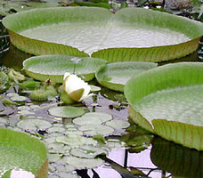
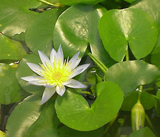

# Nymphaeaceae

Water lilies and their relatives. 

 

 

## Phylogeny 

-   « Ancestral Groups  
    -   [Flowering_Plant](../Flowering_Plant.md)
    -   [Seed_Plant](../../Seed_Plant.md)
    -   [Land_Plant](../../../Land_Plant.md)
    -   [Green plants](../../../../Plants.md)
    -   [Eukaryotes](Eukaryotes)
    -   [Tree of Life](../../../../../Tree_of_Life.md)

-   ◊ Sibling Groups of  Angiosperms
    -   [Amborella trichopoda](Amborella.md)
    -   [Magnoliids](Magnoliids.md)
    -   [Chloranthaceae](Chloranthaceae.md)
    -   [Ceratophyllaceae](Ceratophyllaceae.md)
    -   [Monocot](Monocot.md)
    -   [Eudicots](Eudicots.md)
    -   [Austrobaileyales](Austrobaileyales.md)
    -   Nymphaeaceae

-   » Sub-Groups 

## Title Illustrations

------------------------------------------------------------------------
 
Scientific Name ::   Victoria cruziana
Comments           The Santa Cruz water lily, native to northern Argentina, Paraguay and Bolivia. The photographed specimens were cultivated at the Botanical Garden Basel, Switzerland.
Acknowledgements   Photograph courtesy [Botanical Image Database](http://www.unibas.ch/botimage/)
Copyright ::          © 2001 University of Basel, Basel, Switzerland 

---------------------

Scientific Name ::     Nuphar japonica
Specimen Condition   Live Specimen
Identified By        Sangtae Kim
Body Part            Flower
Copyright ::            © 2005 [Sangtae Kim](mailto:sangtae@botany.ufl.edu)

---------------------------------------------------------------------
 
Scientific Name ::  Nymphaea thermarum
Location ::        endemic to Rwanda
Copyright ::         © [Kurt Stüber](http://www.biolib.de/) 

## Confidential Links & Embeds: 

### [Nymphaeaceae](/_Standards/bio/bio~Domain/Eukaryotes/Plants/Land_Plant/Seed_Plant/Flowering_Plant/Nymphaeaceae.md) 

### [Nymphaeaceae.public](/_public/bio/bio~Domain/Eukaryotes/Plants/Land_Plant/Seed_Plant/Flowering_Plant/Nymphaeaceae.public.md) 

### [Nymphaeaceae.internal](/_internal/bio/bio~Domain/Eukaryotes/Plants/Land_Plant/Seed_Plant/Flowering_Plant/Nymphaeaceae.internal.md) 

### [Nymphaeaceae.protect](/_protect/bio/bio~Domain/Eukaryotes/Plants/Land_Plant/Seed_Plant/Flowering_Plant/Nymphaeaceae.protect.md) 

### [Nymphaeaceae.private](/_private/bio/bio~Domain/Eukaryotes/Plants/Land_Plant/Seed_Plant/Flowering_Plant/Nymphaeaceae.private.md) 

### [Nymphaeaceae.personal](/_personal/bio/bio~Domain/Eukaryotes/Plants/Land_Plant/Seed_Plant/Flowering_Plant/Nymphaeaceae.personal.md) 

### [Nymphaeaceae.secret](/_secret/bio/bio~Domain/Eukaryotes/Plants/Land_Plant/Seed_Plant/Flowering_Plant/Nymphaeaceae.secret.md)

