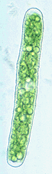
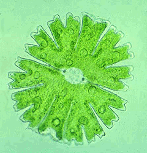

-   Spirogyra (Zygnemataceae)
-   Penium (Peniaceae)
-   Micrasterias (Desmidiaceae)
# [[Zygnematales]]  

     
Photographs copyright © 1995, Rick McCourt.

The order Zygnematales comprises the conjugating green algae. 
This order is the largest and most diverse of the living groups of green algae in the Streptophyta.

## #has_/text_of_/abstract 

> The **Zygnematales** (Greek: ζυγός (zygós) and νῆμα (nḗma) (nom.), νήματος (nḗmatos) (gen.)), 
> also called the Conjugatales, are an order of green algae, 
> comprising several thousand different species in two families. 
> 
> The larger family Zygnemataceae, with well-known genera such as Zygnema and Spirogyra, 
> includes members that grow as unbranched filaments, which grow longer through normal cell division. 
> This group includes the desmids. 
> 
> Most members of both families live in freshwater, 
> and form an important component of the algal scum that grows on or near plants and rocks.
>
> Systematically they fall within the division Charophyta/Streptophyta, 
> in which the land plants (Embryophyta) emerged.
>
> Sexual reproduction in Zygnematales takes place through a process called conjugation. 
> Here filaments of opposite gender line up, and tubes form between corresponding cells. 
> The male cells then become amoeboid and crawl across, or sometimes both cells crawl into the tube. 
> The cells then meet and fuse to form a zygote, 
> which later undergoes meiosis to produce new filaments. 
> As in plants, only the female passes chloroplasts on to the offspring.
>
> Other conjugating algae are the Mesotaeniaceae, sister of the Zygnematales, 
> and Spirotaenia, a basal green algae. 
> 
> Additionally, the Desmidiales appear to have emerged deep within the Zygnematales, 
> and are also conjugating.
>
> [Wikipedia](https://en.wikipedia.org/wiki/Zygnematales) 

## Phylogeny 

-   « Ancestral Groups  
    -   [Green plants](../Plants.md)
    -   [Eukaryotes](Eukaryotes)
    -   [Tree of Life](../../Tree_of_Life.md)

-   ◊ Sibling Groups of  Green plants
    -   Zygnematales
    -   [Charales](Charales.md)
    -   [Land_Plant](Land_Plant.md)

-   » Sub-Groups 

## Introduction

[Richard M. McCourt]()

The conjugating green algae are among the most common algae in
freshwater streams, ponds, and lakes. Including such familiar algae as
*Spirogyra*, these algae, unlike most other green algae, lack
flagellated cells at any time during the life cycle. They reproduce
sexually through several variations of the process known as conjugation,
in which haploid vegetative cells come close together and form
nonflagellated gametes that fuse to form a zygote. Meiosis occurs in the
zygote and from one to four offspring emerge at germination.

The thalli (the bodies of the algae) are of various types, including
single cells, filaments or chains of cells, and colonies. These algae
have been observed by microscopists for over a century, for scientific
interest and intrinsic beauty.

There are approximately 56 genera in five families within this group.
Families of the Zygnematales are distinguished by differences in the
structure of wall of the vegetative cell. The Zygnemataceae and
Mesotaeniaceae have smooth, unsegmented cell walls. The wall of each
vegetative cell in the Gonatozygaceae, Closteriaceae, and Peniaceae
consists of two similar pieces joined in the center of the cell; these
families also exhibit various sculpturing patterns and pores that
penetrate through the outer wall layer. The wall of a vegetative cell in
the Desmidiaceae also consists of two mirror-image parts, but the cell
is deeply incised in the center where the two parts join. Wall
sculpturing is more elaborate in the Desmidiaceae, and pores extend
completely through the wall. The Zygnemataceae contains unbranched
filamentous forms. The Mesotaeniaceae consists mostly of unicellular
algae. The other three families contain unicells, filaments or chains of
cells, or colonies.

Systematics of the group is summarized in Bold and Wynne (1985) and
Hoshaw et al. (1990).

For summaries of studies on the natural history of these organisms, see
Hoshaw (1968), Hoshaw and McCourt (1988), and Hoshaw et al. (1990).

### Discussion of Phylogenetic Relationships

Morphological analyses have differed in their arrangement of the many
genera in this group Classification has generally reflected underlying
evolutionary hypotheses of the authors (West, 1904; West and Fritsch,
1927; Fritsch, 1935; Prescott et al., 1972). The phylogeny shown here
reflects the widely accepted classification of Mix (1972, 1973), who
examined vegetative wall structure in detail (see Notes about Terminal
Taxa).

Molecular studies of small-subunit rDNA have generally confirm the Mix
classification (Surek et al., 1993; Bhattacharya et al., 1994), although
these studies and that of McCourt et al. (1995) suggest that the two
families with smooth, unsculptured walls may be polyphyletic.

## Confidential Links & Embeds: 

### [Zygnematales](/_Standards/bio/bio~Domain/Eukaryotes/Plants/Zygnematales.md) 

### [Zygnematales.public](/_public/bio/bio~Domain/Eukaryotes/Plants/Zygnematales.public.md) 

### [Zygnematales.internal](/_internal/bio/bio~Domain/Eukaryotes/Plants/Zygnematales.internal.md) 

### [Zygnematales.protect](/_protect/bio/bio~Domain/Eukaryotes/Plants/Zygnematales.protect.md) 

### [Zygnematales.private](/_private/bio/bio~Domain/Eukaryotes/Plants/Zygnematales.private.md) 

### [Zygnematales.personal](/_personal/bio/bio~Domain/Eukaryotes/Plants/Zygnematales.personal.md) 

### [Zygnematales.secret](/_secret/bio/bio~Domain/Eukaryotes/Plants/Zygnematales.secret.md)

