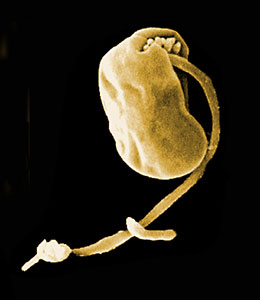

---
title: Ancyromonas
---

## Phylogeny 

-   « Ancestral Groups  
    -   [The other protists](The_other_protists)
    -   [Eukaryotes](Eukaryotes)
    -   [Tree of Life](../../Tree_of_Life.md)

-   ◊ Sibling Groups of  The other protists
    -   Ancyromonas
    -   [Luffisphaera](Luffisphaera.md)
    -   [Apusomonads](Apusomonads.md)
    -   [Chlorarachniophytes](Chlorarachniophytes.md)

-   » Sub-Groups
    -   [Ancyromonas sigmoides](Ancyromonas_sigmoides)
    -   [Ancyromonas melba](Ancyromonas_melba)

# *Ancyromonas* [Kent 1880] 

[David J. Patterson](http://www.tolweb.org/)

-   *Ancyromonas contorta*
-   *[Ancyromonas     sigmoides](Ancyromonas_sigmoides)*
-   *[Ancyromonas     melba](Ancyromonas_melba)*

Containing group: [The other protists](../Protist.md)

## Introduction

*Ancyromonas* cells are small, less than 10 µm. They glide and have two
flagella. The posterior flagellum inserts below the apex of the cell and
trails to the rear; the anterior flagellum may be thin or of normal
size, and it may sometimes be absent. There is usually a groove from the
point of insertion of the posterior flagellum and along the lateral
margin of the cell. The cells wobble as they glide.

This genus is widespread and common. It has been reported from marine
and terrestrial habitats. The organisms probably consume bacteria. Three
species are currently recognised, of which only two (*A. sigmoides* and
*A. melba*) have been reported recently (Patterson and Simpson, 1986).

On the basis of comparisons of small subunit ribosomal RNA genes, Atkins
and co-workers (Atkins et al., 2000) have suggested that *Ancyromonas*
is closely related to the lineage which gave rise to animals and fungi,
although sister group relationships have yet to be resolved.

The type species is *A. sigmoides* Kent 1880.

### Characteristics

The genus has been the subject of one ultrastructural study (Mylnikov
1990) under the generic name *Heteromita*. The genus has mitochondria
with flat cristae. The cell surface is supported by materials within and
external to the cell membrane. There are \'ball and cone\' style
extrusomes present. The most similar taxa are *Metopion* and
*Caecitellus*, but *Ancyromonas* can be distinguished from both by the
site at which the anterior flagellum inserts.

### Discussion of Phylogenetic Relationships

Phylogenetic relationships among the species in this genus have not yet
been investigated.

### References

Atkins, M. S., A. G. McArthur, and A. P. Teske. 2000. Ancyromonadida: a
new phylogenetic lineage among the protozoa closely related to the
common ancestor of metazoans, fungi and choanoflagellates
(Opisthokonta). Journal of Molecular Evolution 51:278-285.

Hänel, K. 1979. Systematik und Ökologie der farblosen Flagellaten des
Abwassers. Arch. Protistenkd. 121:73-137.

Mylnikov, A. P. 1990. Characteristic features of the ultrastructure of
colourless flagellate Heteromita sp. Tsitologiya 32:567-571. (In
Russian)

Patterson D. J. and Simpson, A. G. B. 1996. Heterotrophic flagellates
from coastal marine and hypersaline sediments in Western Australia.
European Journal of Protistology 32:423-448.

## Title Illustrations



  ------------------
  Scientific Name ::  Ancyromonas sigmoides
  Comments          Scanning electron micrograph
  Copyright ::         © 2000 Michael S. Atkins and O. Roger Anderson
  ------------------

## Confidential Links & Embeds: 

### #is_/same_as :: [Ancyromonas](/_Standards/bio/bio~Domain/Eukaryotes/Protist/Ancyromonas.md) 

### #is_/same_as :: [Ancyromonas.public](/_public/bio/bio~Domain/Eukaryotes/Protist/Ancyromonas.public.md) 

### #is_/same_as :: [Ancyromonas.internal](/_internal/bio/bio~Domain/Eukaryotes/Protist/Ancyromonas.internal.md) 

### #is_/same_as :: [Ancyromonas.protect](/_protect/bio/bio~Domain/Eukaryotes/Protist/Ancyromonas.protect.md) 

### #is_/same_as :: [Ancyromonas.private](/_private/bio/bio~Domain/Eukaryotes/Protist/Ancyromonas.private.md) 

### #is_/same_as :: [Ancyromonas.personal](/_personal/bio/bio~Domain/Eukaryotes/Protist/Ancyromonas.personal.md) 

### #is_/same_as :: [Ancyromonas.secret](/_secret/bio/bio~Domain/Eukaryotes/Protist/Ancyromonas.secret.md)

