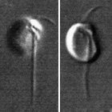

---
title: "Ancyromonas melba"
---

## Phylogeny 

-   « Ancestral Groups  
    -   [Ancyromonas](../Ancyromonas.md)
    -   [The other protists](The_other_protists)
    -   [Eukaryotes](Eukaryotes)
    -   [Tree of Life](../../../Tree_of_Life.md)

-   ◊ Sibling Groups of  Ancyromonas
    -   [Ancyromonas sigmoides](Ancyromonas_sigmoides)
    -   Ancyromonas melba

-   » Sub-Groups 

# *Ancyromonas melba* [Patterson and Simpson 1996] 

[David J. Patterson](http://www.tolweb.org/)

Containing group: *[Ancyromonas](../Ancyromonas.md)*

## Introduction

Cells are 5-7 µm long, oval shaped and dorso-ventrally flattened with
the ventral side hollowed. The anterior end of the cell is set off by a
ventral groove running from the left lateral margin to the right ventral
part of the cell. The resulting \'snout\' has a few indistinct granules
running along it. The vental groove continues longitudinally as a slight
ventral crease. The cell usually glides on a posterior flagellum which
emerges near the anterior-most termination of the ventral groove. This
flagellum is usually held under the cell during gliding. The posterior
flagellum is 1-2 times cell length and tapers gradually along its
length. The anterior flagellum emerges from a slight depression at the
right anterior end of the cell and sweeps in front of the cell as it
glides. This flagellum is about the length of the cell and is of similar
thickness as the posterior flagellum.

This species has been reported from hypersaline habitats in Western
Australia and from Antarctica (Patterson and Simpson, 1996).

### Characteristics

This species is strongly reminiscent of the widespread and common
[Ancyromonas sigmoides](tree?group=Ancyromonas_sigmoides&contgroup=Ancyromonas)
in size, dorso-ventral flattening, gliding, presence of a groove from
left margin to right ventral side of cell, refractile granules along the
snout, posterior flagellum arising from ventral depression, and anterior
flagellum if present arising from small depression near the base of the
snout. It can be distinguished from A. sigmoides because, in A.
sigmoides, the anterior flagellum is short or non-existent. Also, the
groove in A. melba is located exclusively on the ventral surface, while
the posterior part of the groove of A. sigmoides runs along the margin
of the cell. In A. melba cells the recurrent flagellum lies closer to
the mid-line of the body, whereas in A. sigmoides it is located
marginally or projects from the side of the cell, and A. melba is
usually larger and appears more ventrally hollowed.

The prominent anterior flagellum of A. melba makes it easy to
distinguish this species from Metopion fluens. Caecitellus parvulus has
a prominent anterior flagellum like A. melba but differs because the two
flagella appear to emerge from the anterio-posterior axis of the cell.
Caecitellus has an ingestion apparatus supported by a hoop of
cytoskeletal material and no rostrum.

### References

Patterson D. J. and Simpson, A. G. B. 1996. Heterotrophic flagellates
from coastal marine and hypersaline sediments in Western Australia.
European Journal of Protistology 32:423-448.

## Title Illustrations



  --------------------------------------------------------------------------------
  Scientific Name ::  Ancyromonas melba
  Copyright ::         © 2000 [David J. Patterson](http://www.bio.usyd.edu.au/Protsvil/index.htm) 
  --------------------------------------------------------------------------------


  ---------------------------
  Scientific Name ::     Ancyromonas melba
  Comments             Light micrographs of living cells (Differential Interference Contrast)
  Specimen Condition   Live Specimen
  Copyright ::            © 2000 David J. Patterson and Alastair Simpson
  ---------------------------

## Confidential Links & Embeds: 

### #is_/same_as :: [melba](/_Standards/bio/bio~Domain/Eukaryotes/Protist/Ancyromonas/melba.md) 

### #is_/same_as :: [melba.public](/_public/bio/bio~Domain/Eukaryotes/Protist/Ancyromonas/melba.public.md) 

### #is_/same_as :: [melba.internal](/_internal/bio/bio~Domain/Eukaryotes/Protist/Ancyromonas/melba.internal.md) 

### #is_/same_as :: [melba.protect](/_protect/bio/bio~Domain/Eukaryotes/Protist/Ancyromonas/melba.protect.md) 

### #is_/same_as :: [melba.private](/_private/bio/bio~Domain/Eukaryotes/Protist/Ancyromonas/melba.private.md) 

### #is_/same_as :: [melba.personal](/_personal/bio/bio~Domain/Eukaryotes/Protist/Ancyromonas/melba.personal.md) 

### #is_/same_as :: [melba.secret](/_secret/bio/bio~Domain/Eukaryotes/Protist/Ancyromonas/melba.secret.md)

