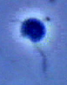

## Phylogeny 

-   « Ancestral Groups  
    -   [Ancyromonas](../Ancyromonas.md)
    -   [The other protists](The_other_protists)
    -   [Eukaryotes](Eukaryotes)
    -   [Tree of Life](../../../Tree_of_Life.md)

-   ◊ Sibling Groups of  Ancyromonas
    -   Ancyromonas sigmoides
    -   [Ancyromonas melba](Ancyromonas_melba)

-   » Sub-Groups 

# *Ancyromonas sigmoides* [Kent 1880] 

[David J. Patterson](http://www.tolweb.org/)

Containing group: *[Ancyromonas](../Ancyromonas.md)*

## Introduction

Ancyromonas sigmoides is the most widely reported species in the genus,
as well as being the type species. It has been reported from
freshwaters, soil and marine habitats from around the world. Lee and
Patterson (2000) give a recent account.

Synonyms:\"Bodo cephaloporus\"

### Characteristics

The cell outline is oval, and cells measure from 3 to 7 µm long; they
are dorso-ventrally flattened. This species has a shallow groove
ventrally near an antero-lateral margin of the cell. Cells may or may
not have a thin stiff anterior flagellum emerging from an anterior
depression. The anterior flagellum can be easily overlooked. The
posterior flagellum is about 1.5 times the length of the cell and may
have the same width along its length. The cell moves by gliding with the
posterior flagellum trailing.

### References

Lee, W. J. and Patterson, D. J. 2000. Heterotrophic flagellates
(Protista) from marine sediments of Botany Bay, Australia. Journal of
Natural History 34:483-562.

Kent, W. S. 1880-1882. Manual of the Infusoria. Three volumes, Bogue,
London.

## Title Illustrations



  --------------------------------------------------------------------------------
  Scientific Name ::  Ancyromonas sigmoides
  Copyright ::         © 2000 [David J. Patterson](http://www.bio.usyd.edu.au/Protsvil/index.htm) 
  --------------------------------------------------------------------------------


  ---------------------------------------------------------------------------------
  Scientific Name ::     Ancyromonas sigmoides
  Comments             Phase contrast micrograph of living cell
  Specimen Condition   Live Specimen
  Copyright ::            © 2000 [David J. Patterson](http://www.bio.usyd.edu.au/Protsvil/index.htm) 
  ---------------------------------------------------------------------------------
