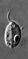
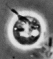
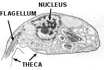

---
title: Apusomonads
---

## Phylogeny 

-   « Ancestral Groups  
    -   [The other protists](The_other_protists)
    -   [Eukaryotes](Eukaryotes)
    -   [Tree of Life](../../Tree_of_Life.md)

-   ◊ Sibling Groups of  The other protists
    -   [Ancyromonas](Ancyromonas.md)
    -   [Luffisphaera](Luffisphaera.md)
    -   Apusomonads
    -   [Chlorarachniophytes](Chlorarachniophytes.md)

-   » Sub-Groups
    -   [Apusomonas](Apusomonads/Apusomonas.md)
    -   [Amastigomonas](Apusomonads/Amastigomonas.md)

# Apusomonads

## Apusomonadidae [Karpov & Mylnikov 1989] 

[David J. Patterson](http://www.tolweb.org/)

-   *[Apusomonas](Apusomonads/Apusomonas.md "go to ToL page")*
-   *[Amastigomonas](Apusomonads/Amastigomonas.md "go to ToL page")*

Containing group: [The other protists](../Protist.md)

## Introduction

The apusomonads (also called thecamonads) include two genera and about
10 species of small gliding flagellates. They occur in soils, freshwater
and marine habitats and have a world-wide distribution. They are tectic
organisms inasmuch as they are associated with surfaces (of particles,
of sediment or of detritus such as dead dogs). They can be common and
abundant. They consume bacteria, often using pseudopodia which emerge
from the ventral face of the cell to do so. The genera were grouped into
an order - the Apusomonadida by Karpov and Mylnikov in 1991.

### Characteristics

Transmission electron micrograph of *Amastigomonas debruynei*. The
anterior of the cell, with the projecting flagellum, is to the left. The
illustration shows the organic layer which is attached to the cell and
lies around the flagellum.\
Micrograph copyright © 2000 David J. Patterson.

Apusomonads are flagellates with tubular mitochondrial cristae. They are
distinguished from other tubulocristate flagellates by the presence of a
flexible organic lorica or theca which lies over the dorsal face of the
cell and ensheaths the basal part of the anterior flagellum. Apusomonads
have two flagella, the first extends anterior or anterio-laterally, the
second trails behind the cell. The two basal bodies insert almost at
right angles and give rise to four microtubular roots, two of which
determine the margins of the ventral face of the cell.

### Discussion of Phylogenetic Relationships

The two genera of apusomonads are regarded as sister taxa because all
studied representatives of both genera have an external theca. The
synapomorphy of the genus *Apusomonas* is the mastigophore - the
anterior projection into which the anterior flagellum inserts. This
trait is not seen in any other taxa and is believed to be derived. The
genus *Amastigomonas* may be paraphyletic since there are no known
synapomorphies for the five species contained within this group.

### References

Cavalier-Smith, T. and Chao, E.E. 1995. The opalozoan Apusomonas is
related to the common ancestor of animals, fungi and choanoflagellates.
Proceedings of the Royal Society of London, B, 261: 1-6.

Ekelund, F. and Patterson, D.J. 1997. Some flagellates from a cultivated
garden soil in Australia. Archiv fur Protistenkunde 148: 461-478.

Karpov S. A. & Mylnikov A. P. 1989. Biology and ultrastructure of
colourless flagellates Apusomonadida ord. n. Zoologischkei Zhurnal 58:
5-17. (in Russian)

Molina, F. I. and Nerad, T. A. 1991, Ultrastructure of Amastigomonas
bermudensis ATCC 50234 sp.nov. - a new heterotrophic marine flagellate,
European Journal of Protistology, 27, 386-396.

Patterson, D. J. 1999. The diversity of eukaryotes. American Naturalist
154: S96-124.

## Title Illustrations



  ---------------------------------------------------------------------------------
  Scientific Name ::     Amastigomonas debruynei
  Specimen Condition   Dead Specimen
  Copyright ::            © 2000 [David J. Patterson](http://www.bio.usyd.edu.au/Protsvil/index.htm) 
  ---------------------------------------------------------------------------------


  ------------
  Scientific Name ::  Apusomonas proboscidea
  Copyright ::         © 2000 Flemming Ekelund
  ------------

## Confidential Links & Embeds: 

### #is_/same_as :: [Apusomonads](/_Standards/bio/bio~Domain/Eukaryotes/Protist/Apusomonads.md) 

### #is_/same_as :: [Apusomonads.public](/_public/bio/bio~Domain/Eukaryotes/Protist/Apusomonads.public.md) 

### #is_/same_as :: [Apusomonads.internal](/_internal/bio/bio~Domain/Eukaryotes/Protist/Apusomonads.internal.md) 

### #is_/same_as :: [Apusomonads.protect](/_protect/bio/bio~Domain/Eukaryotes/Protist/Apusomonads.protect.md) 

### #is_/same_as :: [Apusomonads.private](/_private/bio/bio~Domain/Eukaryotes/Protist/Apusomonads.private.md) 

### #is_/same_as :: [Apusomonads.personal](/_personal/bio/bio~Domain/Eukaryotes/Protist/Apusomonads.personal.md) 

### #is_/same_as :: [Apusomonads.secret](/_secret/bio/bio~Domain/Eukaryotes/Protist/Apusomonads.secret.md)

