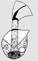
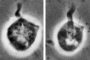

## Phylogeny 

-   « Ancestral Groups  
    -   [Apusomonas](../Apusomonas.md)
    -   [Apusomonads](../../Apusomonads.md)
    -   [The other protists](The_other_protists)
    -   [Eukaryotes](Eukaryotes)
    -   [Tree of Life](../../../../Tree_of_Life.md)

-   ◊ Sibling Groups of  Apusomonas
    -   [Apusomonas proboscidea](Apusomonas_proboscidea)
    -   Apusomonas australiensis

-   » Sub-Groups 

# *Apusomonas australiensis* [Ekelund and Patterson 1997] 

[David J. Patterson](http://www.tolweb.org/)

Containing group: *[Apusomonas](../Apusomonas.md)*

## Introduction

This species of *Apusomonas* has a pointed bulge at the left anterior
corner of the theca. It also has a very flexible mastigophore. It has
been reported from Australia.

*Apusomonas australiensis* is distinguished from *A. proboscidea*, the
only other species in the genus, because of the projection from the
anterior margin of the cell and because the mastigophore is more
flexible and snake-like. Other characters of the two flagellates are
very similar. *A. australiensis* is much more abundant than *A.
proboscidea*, and intermediate forms were never observed.

### Characteristics

This species is 6 - 10 µm long, dorso-ventrally flattened, irregularly
ovate in outline, asymmetrical. The right side more rounded than the
left, because the left anterior corner has a pointed bulge. The
mastigophore is very flexible. It is approximately the same length as
the cell and arises in a cavity about one third of the cell length from
the posterior end. The ensheathed anterior flagellum arises at the
distal end of the mastigophore, and sheath plus flagellum is about half
the cell length and about half as broad as the mastigophore. The distal
third to quarter of the anterior flagellum is not ensheathed. A
collar-like structure is seen where the mastigophore leaves the cell.
The nucleus is situated posteriorly, a contractile vacuole is located in
the mid-left-hand side of the cell. The cell glides over the substrate
with a speed of about 10 µm/s. The ensheathed anterior flagellum beats
rapidly to the left, the stroke covering an angle of about 45°.

### References

Ekelund, F. and Patterson, D. J. 1997. Some flagellates from a
cultivated garden soil in Australia. Archiv für Protistenkunde
148:461-478.

## Title Illustrations



  ------------
  Scientific Name ::     Apusomonas australiensis
  Specimen Condition   Live Specimen
  Copyright ::            © 2000 Flemming Ekelund
  ------------


  -----------------
  Scientific Name ::     Apusomonas australiensis
  Comments             phase contrast micrograph of living cell
  Specimen Condition   Live Specimen
  Copyright ::            © 2000 Flemming Ekelund
  -----------------

## Confidential Links & Embeds: 

### [australiensis](/_Standards/bio/bio~Domain/Eukaryotes/Protist/Apusomonads/Apusomonas/australiensis.md) 

### [australiensis.public](/_public/bio/bio~Domain/Eukaryotes/Protist/Apusomonads/Apusomonas/australiensis.public.md) 

### [australiensis.internal](/_internal/bio/bio~Domain/Eukaryotes/Protist/Apusomonads/Apusomonas/australiensis.internal.md) 

### [australiensis.protect](/_protect/bio/bio~Domain/Eukaryotes/Protist/Apusomonads/Apusomonas/australiensis.protect.md) 

### [australiensis.private](/_private/bio/bio~Domain/Eukaryotes/Protist/Apusomonads/Apusomonas/australiensis.private.md) 

### [australiensis.personal](/_personal/bio/bio~Domain/Eukaryotes/Protist/Apusomonads/Apusomonas/australiensis.personal.md) 

### [australiensis.secret](/_secret/bio/bio~Domain/Eukaryotes/Protist/Apusomonads/Apusomonas/australiensis.secret.md)

