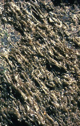

# [[Rhodophyta]]

Red Algae 

   

## #has_/text_of_/abstract 

> **Red Algae**, or Rhodophyta (from Ancient Greek  ῥόδον (rhódon) 'rose' and  φυτόν (phutón) 'plant'), 
> make up one of the oldest groups of eukaryotic algae. 
> 
> The Rhodophyta comprises one of the largest phyla of algae, 
> containing over 7,000 recognized species within over 900 genera amidst ongoing taxonomic revisions. 
> The majority of species (6,793) are Florideophyceae, 
> and mostly consist of multicellular, marine algae, including many notable seaweeds. 
> 
> Red algae are abundant in marine habitats. 
> Approximately 5% of red algae species occur in freshwater environments, 
> with greater concentrations in warmer areas. 
> Except for two coastal cave dwelling species in the asexual class Cyanidiophyceae, 
> no terrestrial species exist, 
> which may be due to an evolutionary bottleneck in which the last common ancestor 
> lost about 25% of its core genes and much of its evolutionary plasticity.
>
> Red algae form a distinct group characterized by eukaryotic cells without flagella and centrioles, 
> chloroplasts without external endoplasmic reticulum or unstacked (stroma) thylakoids, 
> and use phycobiliproteins as accessory pigments, which give them their red color. 
> 
> Despite their name, red algae can vary in color from bright green, soft pink, resembling brown algae, 
> to shades of red and purple, and may be almost black at greater depths. 
> 
> Unlike green algae, red algae store sugars as food reserves outside the chloroplasts as floridean starch, 
> a type of starch that consists of highly branched amylopectin without amylose. 
> 
> Most red algae are multicellular, macroscopic, and reproduce sexually. 
> The life history of red algae is typically an alternation of generations 
> that may have three generations rather than two. 
> Coralline algae, which secrete calcium carbonate and play a major role in building coral reefs, 
> belong there. 
>
> Red algae such as Palmaria palmata (dulse) and Porphyra species (laver/nori/gim) 
> are a traditional part of European and Asian cuisines 
> and are used to make products such as agar, carrageenans, and other food additives.
>
> [Wikipedia](https://en.wikipedia.org/wiki/Red%20algae) 

## Phylogeny 

-   « Ancestral Groups  
    -   [Eukaryotes](Eukaryotes)
    -   [Tree of Life](../Tree_of_Life.md)

-   ◊ Sibling Groups of  Eukaryotes
    -   [Choanoflagellates](Choanoflagellates)
    -   [Animals](Animals)
    -   [Fungi](Fungi)
    -   [Stramenopiles](Stramenopiles)
    -   [Alveolates](Alveolates)
    -   Rhodophyta
    -   [Green plants](Plants.md)
    -   [The other protists](The_other_protists)

-   » Sub-Groups
    -   [Florideophyceae](Florideophyceae.md)

-   *Cyanidium*
-   *Porphyridiales* [\*]
-   *Compsopogonales* [\*]
-   *Bangiales* [\*]
-   *[Florideophyceae](Florideophyceae.md "go to ToL page")*

## Introduction

[D. Wilson Freshwater](http://tolweb.org/Rhodophyta/2381#AboutThisPage) 

The Rhodophyta (red algae) are a distinct eukaryotic lineage
characterized by the accessory photosynthetic pigments phycoerythrin,
phycocyanin and allophycocyanins arranged in phycobilisomes, and the
absence of flagella and centrioles (Woelkerling 1990). This is a large
assemblage of between 2500 and 6000 species in about 670 largely marine
genera (Woelkerling 1990) that predominate along the coastal and
continental shelf areas of tropical, temperate and cold-water regions
(Lüning 1990). Red algae are ecologically significant as primary
producers, providers of structural habitat for other marine organisms,
and their important role in the primary establishment and maintenance of
coral reefs. Some red algae are economically important as providers of
food and gels. For this reason, extensive farming and natural harvest of
red algae occurs in numerous areas of the world.

Figure 1. Seaweed farmers tending a Kappaphycus line culture in the
Philippines.\
Kappaphycus and other Gigartinales species are grown commercially for
the extraction of carrageenan, a gel used in many food products.\
Image copyright © 2000, D. F. Kapraun.

### Characteristics

Red algae have a number of general characteristics that in combination
distinguish them from other eukaryotic groups:

-   absence of flagella and centrioles
-   floridean starch as a storage product and the storage of starch in
    the cytoplasm (Figure 2)
-   phycoerythrin, phycocyanin, and allophycocyanin as accessory
    pigments
-   unstacked thylakoids in plastids (Figure 3)
-   no chloroplast endoplasmic reticulum

Figure 2. Griffithsia pacifica (Florideophyceae). Electron micrograph
showing cytoplasm with numerous chloroplasts (C) and starch (S). Starch
is the photosynthetic reserve and is deposited free in the cytoplasm.\
Image copyright © 2000, C. M. Pueschel.

Figure 3. Griffithsia pacifica (Florideophyceae). Close-up of figure 2
electron micrograph showing a chloroplast with unstacked photosynthetic
lamellae (arrows) bearing granules, called phycobilosomes (arrowheads),
composed of water-soluble phycobiliprotein accessory pigments.\
Image copyright © 2000, C. M. Pueschel.

### Discussion of Phylogenetic Relationships

Traditionally the red algae were divided into two Classes the
Bangiophyceae and Florideophyceae. Alternatively a single Class, the
Rhodophyceae and two Subclasses, Bangiophycidae and Florideophycidae are
used. Based on ultrastructure and molecular evidence the Bangiophyceae
is now accepted as a paraphyletic group, while the Florideophyceae is
considered to be monophyletic based on two synapomorphic characters -
presence of a filamentous gonimoblast and tetrasporangia (Garbary &
Gabrielson 1990 \[and references within\], Ragan et al. 1994).

## Title Illustrations

---------------------------------------------------------------------------
 
  Scientific Name ::  Kallymenia perforata
  Location ::        Collected from coral reef near Zamboanga, Mindanao, Philippines
  Comments          Florideophyceae
  Copyright ::         © 2000 [D. Wilson Freshwater](mailto:freshwaterw@uncw.edu) 

---------------------------------------------------------------------------
 
  Scientific Name ::  Gibsmithia hawaiiensis
  Location ::        Collected from coral reef near Zamboanga, Mindanao, Philippines
  Comments          Florideophyceae
  Copyright ::         © 2000 [D. Wilson Freshwater](mailto:freshwaterw@uncw.edu) 

---------------------------------------------------------------------------

  Scientific Name ::  Porphyra carolinensis
  Location ::        Masonboro Island, North Carolina, USA
  Comments          Bangiales. Growing on rocks in the upper intertidal zone.
  Copyright ::         © 2000 [D. Wilson Freshwater](mailto:freshwaterw@uncw.edu) 

