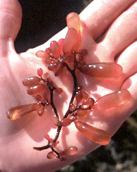
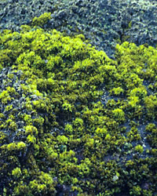
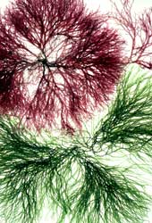

## Phylogeny 

-   « Ancestral Groups  
    -   [Rhodophyta](Rhodophyta)
    -   [Eukaryotes](Eukaryotes)
    -   [Tree of Life](../../Tree_of_Life.md)

-   ◊ Sibling Groups of  Rhodophyta
    -   Florideophyceae

-   » Sub-Groups
    -   [Ceramiales](Ceramiales.md)
    -   [Gelidiales](Gelidiales.md)

# [[Florideophyceae]] 

   

## #has_/text_of_/abstract 

> **Florideophyceae** is a class of exclusively multicellular red algae. 
> 
> They were once thought to be the only algae to bear pit connections, 
> but these have since been found in the filamentous stage of the Bangiaceae. 
> 
> They were also thought only to exhibit apical growth, 
> but there are genera known to grow by intercalary growth. 
> 
> Most, but not all, genera have three phases to the life cycle. 
> In the subclass Nemaliophycidae there are three orders, 
> Balbianiales, Batrachospermales, and Thoreales, which lives exclusively in freshwater.
>
> [Wikipedia](https://en.wikipedia.org/wiki/Florideophyceae) 

## Introduction

[D. Wilson Freshwater](http://tolweb.org/Florideophyceae/21781#AboutThisPage) 

The Florideophyceae is a well-defined assemblage of red algae that share
a number of characters including the presence of tetrasporangia, and a
filamentous gonimoblast. Some species are used directly by humans for
food, while cell wall polysaccharides are extracted from others for use
as gels, and additives in food and cosmetic products.

### Characteristics

While exceptions are known, members of the Florideophyceae generally
share a majority of the following characteristics:

-   a multicellular thallus with apical growth
-   the presence of pit connections (Figure 1)
-   a filamentous gonimoblast
-   tetrasporangia
-   cells with multiple nuclei and plastids (Figure 2)
-   life histories that are some variation of a triphasic alternation of
    generations (Figure 3)

Figure 1. Electron micrograph of a Cumagloia andersonii (Nemaliales) pit
plug. The pit plug occupies an aperture in the cell wall (W) and
consists of a plug core (Co), flanked on either end by a thin inner cap
layer (IC), and a plate-like outer cap layer (OC).\
Image copyright © 2000, C.M. Pueschel.

Figure 2. DAPI stained cell of Agardhiella subulata showing multiple
brightly fluorescing nuclei.\
Image copyright © 2000, D.F. Kapraun.

Figure 3. Diagram of triphasic life history. Haploid (1N) male
gametophytes produce spermatia that are released, while haploid female
gametophytes produce carpogonia (=egg cells) that are retained on the
female gametophyte. After fertilization, the diploid (2N) zygote is
still retained on the female gametophyte and develops into the diploid
carposporophyte. The carposporophyte produces diploid carpospores that
are released and develop into the diploid tetrasporophyte. The
tetrasporophyte produces tetrasporangia where meiotic divisions result
in haploid tetraspores. These tetraspores then develop into haploid
gametophytes completing the life cycle.\
Image copyright © 2000, D. W. Freshwater.

### Discussion of Phylogenetic Relationships

Hypothesized relationships in the Florideophyceae are in a state of
flux. Traditionally, life history characteristics, and ontogeny of the
female reproductive system and carposporophyte were used to study red
algal relationships. Constraints on development imposed by the
filamentous construction of florideophycean taxa have lead to convergent
evolution in these characters. Interpretation of these characters is
therefore difficult, and in turn has prevented the establishment of
solid hypotheses for higher-level relationships in the Florideophyceae.

Gabrielson and Garbary used cladistic methodology to analyze a data
matrix of 35 red algal characters (Gabrielson and Garbary 1985, 1987,
Garbary and Gabrielson 1990). Their resulting phylogenetic hypothesis
suggested a progression from primitive (Acrochaetiales) to advanced
(Ceramiales) lineages that corresponded to recognized orders.

Four of the characters in Gabrielson and Garbary\'s data matrix involved
the ultrastructure of pit connections, which Pueschel and Cole (1982)
had previously demonstrated could be used to delineate red algal orders.
Pueschel (1994) subsequently developed a phylogenetic hypothesis based
on these characters. In this hypothesis florideophycean taxa with two
pit plug caps form a monophyletic group, and within this group, having a
domed outer cap is the ancestral state (versus having plate-like outer
caps).

Two overall analyses of red algae based on nucleotide sequence data from
the nuclear encoded small ribosomal subunit (SSU) (Ragan et al. 1994),
and the chloroplast encoded large subunit of RuBisCO (rbcL) (Freshwater
et al. 1994) genes were published in 1994. While both analyses suffered
from insufficient taxon sampling, they demonstrated the potential of
sequence analyses for exploring the ordinal level relationships of red
algae. More narrowly focused analyses of sequence data have been used to
help define florideophycean orders (e.g. Fredericq et al. 1996, Saunders
and Kraft 1994, 1996). Saunders and Bailey (1997) used an expanded
analysis of SSU sequence data (70 taxa) to independently examine
Pueschel\'s (1994) hypothesis of evolution based on pit connection
characters, and the resulting tree provided strong support for this
hypothesis. Other aspects of the Saunders and Bailey (1997) tree
relating to florideophycean evolution are discussed in Saunders and
Kraft (1997). More taxon replete analyses of both SSU and rbcL data are
in progress and should result in a well-defined hypothesis of evolution
in the Florideophyceae.

## Title Illustrations

----------------
 
Scientific Name ::  Botryocladia pseudodichotoma
Location ::        collected at Monterey, California, USA
Comments          Rhodymeniales
Copyright ::         © 2000 J. L. Woodhead

---------------------------------------------------------------------------
 
Scientific Name ::  Mazaella cornucopiae
Location ::        Botanical Beach, Vancouver Island, Canada
Comments          Band of Mazaella cornucopiae (Gigartinales) growing on intertidal rocks
Copyright ::         © 2000 [D. Wilson Freshwater](mailto:freshwaterw@uncw.edu) 

--------------------------------
 
Scientific Name ::  Gracilaria
Location ::        Grown in the tank culture facility at Harbor Branch Oceanographic Institute, Florida, USA.
Comments          Red and green color morphs of Gracilaria sp. (Gracilariales)
Copyright ::         © 2000 K. T. Bird
