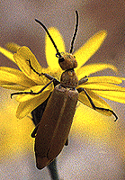

# [[Tree_of_Life]]   

  

## #has_/text_of_/abstract 

> The **Tree of life** is a fundamental archetype 
> in many of the world's mythological, religious, and philosophical traditions. 
> 
> It is closely related to the concept of the sacred tree. 
> 
> The tree of the knowledge of good and evil and the tree of life 
> which appear in Genesis' Garden of Eden as part of the Jewish cosmology of creation, 
> and the tree of knowledge connecting to heaven and the underworld such as Yggdrasil, 
> are forms of the world tree or cosmic tree, 
> and are portrayed in various religions and philosophies as the same tree.
>
> [Wikipedia](https://en.wikipedia.org/wiki/Tree%20of%20life) 

The Tree of Life is a graphical representation 
of the evolutionary relationships among living organisms. 

It depicts the evolutionary history of species, 
illustrating how they are related through common ancestors 
and how they have diversified over time 
through processes such as speciation and genetic divergence.

This  Tree Structure is also mirrored by the File-System Hierarchy, 
where each Folder represents a phylogenetic Group. 

Due to the Depth of this Tree, some Names had to be abbreviated 
to fit into the 260 Character Limit imposed e.g. by Windows. 

Key aspects of the Tree of Life in biological terms include:

### Evolutionary Relationships: 
The branches of the tree represent different lineages of organisms, 
with each branch representing a species or a group of closely related species. 
The arrangement of branches reflects the evolutionary relationships between these organisms, 
showing which species share more recent common ancestors.

### Common Ancestors: 
Nodes or points where branches split 
represent common ancestors shared by groups of organisms. 
These nodes signify points in evolutionary history 
where __divergence occurred__, leading to the formation of new species or groups of species.

### Divergence and Speciation: 
The branching patterns of the tree illustrate the process of speciation, 
whereby new species arise from a common ancestor through __genetic changes__ 
and reproductive __isolation__.
Over time, populations of organisms diverge from one another, 
leading to the formation of distinct species.

### Taxonomic Classification: 
The Tree of Life organizes organisms into hierarchical taxonomic categories 
based on their evolutionary relationships. 
This classification system includes 
domains, kingdoms, phyla, classes, orders, families, genera, and species, 
with each level representing increasing levels of relatedness.

### Biodiversity and Evolutionary History: 
The Tree of Life encompasses the entire diversity of life on Earth, 
from bacteria and archaea to plants, animals, and fungi. 

It provides a framework for understanding the evolutionary history of organisms, 
tracing their origins and relationships back to common ancestors.

### Evolutionary Processes: 
By studying the branching patterns and relationships depicted in the Tree of Life, 
scientists can infer the processes of evolution, 
including natural selection, genetic drift, mutation, and adaptation. 
The tree serves as a visual representation of 
how these processes have shaped the diversity of life over millions of years.

Overall, the Tree of Life is a fundamental concept in biology, 
providing a framework for understanding the evolutionary history 
and relationships of all living organisms on Earth.

## Phylogeny 

-   » Sub-Groups

    -   [Bacteria](Bacteria.md)
    -   [Eukaryotes](Eukaryotes.md)
    -   [Archaea](Archaea.md)
    -   [Virus](Virus.md)

### Discussion of Phylogenetic Relationships

Two alternative views on the relationship of the major lineages
(omitting viruses) are shown below

The \"archaea tree\":

         ,=============== Eubacteria
         |
         |            ,== Euryarchaeota
    =====|  ,=Archaea=|
         `==|         `== Crenarchaeota-Eocytes
            |
            `============ Eukaryotes

The \"eocyte tree\":

         ,======== Eubacteria
         |
         |  ,===== Euryarchaeota
    =====|  |
         `==|  ,== Crenarchaeota-Eocytes
            `==|
               `== Eukaryotes

## Title Illustrations

  ---------------------------------------------------------------------------
  Scientific Name ::     Meloidae
  Location ::           U.S.A.: Arizona
  Comments             Blister beetle (Polyphaga) on a composite flower
  Specimen Condition   Live Specimen
  Copyright ::            © 1995 [David R. Maddison](http://david.bembidion.org/) 
  ---------------------------------------------------------------------------

  ----------------------------------------------------------------------
  Scientific Name ::  Fischerella (Eubacteria, Cyanobacteria)
  Copyright ::         © 1995 [Sue Barns](mailto:sbarns@lanl.gov) 
  ----------------------------------------------------------------------