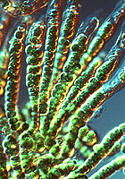

# [[Tree_of_Life]]   

  

The Tree of Life is a graphical representation 
of the evolutionary relationships among living organisms. 

It depicts the evolutionary history of species, 
illustrating how they are related through common ancestors 
and how they have diversified over time 
through processes such as speciation and genetic divergence.

This  Tree Structure is also mirrored by the File-System Hierarchy, 
where each Folder represents a phylogenetic Group. 

Due to the Depth of this Tree, some Names had to be abbreviated 
to fit into the 260 Character Limit imposed e.g. by Windows. 

Key aspects of the Tree of Life in biological terms include:

### Evolutionary Relationships: 
The branches of the tree represent different lineages of organisms, 
with each branch representing a species or a group of closely related species. 
The arrangement of branches reflects the evolutionary relationships between these organisms, 
showing which species share more recent common ancestors.

### Common Ancestors: 
Nodes or points where branches split 
represent common ancestors shared by groups of organisms. 
These nodes signify points in evolutionary history 
where __divergence occurred__, leading to the formation of new species or groups of species.

### Divergence and Speciation: 
The branching patterns of the tree illustrate the process of speciation, 
whereby new species arise from a common ancestor through __genetic changes__ 
and reproductive __isolation__.
Over time, populations of organisms diverge from one another, 
leading to the formation of distinct species.

### Taxonomic Classification: 
The Tree of Life organizes organisms into hierarchical taxonomic categories 
based on their evolutionary relationships. 
This classification system includes 
domains, kingdoms, phyla, classes, orders, families, genera, and species, 
with each level representing increasing levels of relatedness.

### Biodiversity and Evolutionary History: 
The Tree of Life encompasses the entire diversity of life on Earth, 
from bacteria and archaea to plants, animals, and fungi. 

It provides a framework for understanding the evolutionary history of organisms, 
tracing their origins and relationships back to common ancestors.

### Evolutionary Processes: 
By studying the branching patterns and relationships depicted in the Tree of Life, 
scientists can infer the processes of evolution, 
including natural selection, genetic drift, mutation, and adaptation. 
The tree serves as a visual representation of 
how these processes have shaped the diversity of life over millions of years.

Overall, the Tree of Life is a fundamental concept in biology, 
providing a framework for understanding the evolutionary history 
and relationships of all living organisms on Earth.

## Phylogeny 

-   »
    -   Subgroups
    -   [Bacteria](Bacteria.md)
    -   [Eukaryotes](Eukaryotes.md)
    -   [Archaea](Archaea.md)
    -   [Viruses](Viruses.md)

### Information on the Internet

-   [Tree of Life Turns Out to Have Complex     Roots](http://www.samsloan.com/eukarya.htm). New York Times, April
    1998.
-   [Looking for LUCA (the Last Universal Common     Ancestor)](http://www-archbac.u-psud.fr/Meetings/LesTreilles/LesTreilles_e.html).
    Patrick Forterre, Institut de Génétique et Microbiologie Université
    Paris-Sud, France.
-   [The Origins of The Nucleus and the Tree of     Life](http://genomics.ucla.edu/eocyte/) . James Lake, UCLA.
-   [When did eukaryotic cells first evolve? What do we know about how     they evolved from earlier     life-forms?](http://www.sciam.com/askexpert_question.cfm?articleID=000C32DD-60E1-1C72-9EB7809EC588F2D7&catID=3&topicID=3)
    Scientific American, Ask the Experts.
-   [The Beginnings of Life on     Earth](http://www.americanscientist.org/template/AssetDetail/assetid/21438?fulltext=true).
    American Scientist, September-October 1995.
-   [From soup to cells --- the origin of     life](http://evolution.berkeley.edu/evolibrary/article/side_0_0/origsoflife_01).
    From the [Understanding     Evolution](http://evolution.berkeley.edu/evolibrary/home.php) web
    site.
-   [Astrobiology: Environmental Genomes and the Evolution of Complex     Systems in Simple Organisms](http://www.mbl.edu/Astrobiology/).
    Marine Biological Laboratory, Woods Hole, USA.
-   [Astrobiology Web](http://www.astrobiology.com/).
-   [NASA Astrobiology Institute](http://nai.arc.nasa.gov/).
-   [Origins: Galaxies, Stars, Planets . . . and     Life](http://origins.jpl.nasa.gov/). NASA\'s Origins Program.
-   [Astrobiology and the Origins of     Life](http://www.accessexcellence.org/bioforum/bf02/awramik/index.html).
    Online lecture by Stanley Awramik. Access Excellence and the
    California Academy of Sciences BioForum for high school biology
    teachers.
-   [Origins of Life](http://www.resa.net/nasa/origins_life.htm). Wayne
    County Regional Educational Service Agency, USA.
-   [Origin of Life     Research](http://www.gla.ac.uk/Project/originoflife/index.html).
    University of Glasgow, UK.
-   [New York Center for Studies on the Origins of     Life](http://www.origins.rpi.edu/). Rensselaer Polytechnic
    Institute, Troy, NY, USA.
-   [The RNA World Website](http://www.imb-jena.de/RNA.html). Institut
    für Molekulare Biotechnologie Jena, Germany.
-   [Molecular \"Fossils\" Of Early     Life](http://www.eurekalert.org/pub_releases/1998-06/YU-MOEL-050698.php).
    Yale University Press Release, June 1998.
-   [Is life just     genes?](http://news.bbc.co.uk/hi/english/sci/tech/newsid_556000/556958.stm)
    BBC News, December 1999.
-   [Scientists call for life creation     debate](http://news.bbc.co.uk/hi/english/sci/tech/newsid_556000/556984.stm).
    BBC News, December 1999.
-   [Brave New     Biosphere](http://whyfiles.news.wisc.edu/022critters/index.html).
    The discovery of traces of single-celled organisms in a meteorite
    from Mars reminds us that life can inhabit some pretty strange
    places\..... The Why files. August 1996. University of Wisconsin.
-   [No Signs of     Life](http://whyfiles.news.wisc.edu/shorties/mars_rock_not.html). In
    a double whammy powerful enough to vaporize the nastiest
    extraterrestrial bacteria, scientists report that the signs of life
    in a Martian meteorite probably came from Earth\..... The Why files.
    January 1998. University of Wisconsin, USA.
-   [Ancient Organisms Born in Undersea     Inferno](http://www.sfgate.com/cgi-bin/article.cgi?file=/chronicle/archive/2000/06/08/MN44384.DTL&type=science).
    San Francisco Chronicle, June 2000.
-   [Scientists At The Weizmann Institute Propose A New Theory To The     Mystery Of The Origin Of     Life](http://199.203.151.110/weizmann/doa_iis.dll/Serve/item/English/1.200.6.14.html).
    Weizmann Institute of Science Press Release, June 2000.
-   [The Search for Extreme     Life](http://www.sciam.com/article.cfm?articleID=00072444-3A0B-1C74-9B81809EC588EF21&pageNumber=1&catID=2).
    Scientific American, July 2000.
-   [Life at High Temperatures](http://www.bact.wisc.edu/Bact303/b1).
    Thomas D. Brock. Yellowstone Association for Natural Science,
    History & Education, Inc.
-   [DNA from the Beginning](http://www.dnaftb.org/). Dolan DNA Learning
    Center, Cold Spring Harbor Laboratory Cold Spring Harbor, NY.
-   [Cell Biology](http://esg-www.mit.edu:8001/esgbio/cb/cbdir.html).
    MIT Biology Hypertextbook.
-   [Cell     Biology](http://www.biology.arizona.edu/cell_bio/cell_bio.html). The
    Biology Project. University of Arizona, USA.
-   [The Cell](http://library.thinkquest.org/3564/). A ThinkQuest high
    school student project.

### Discussion of Phylogenetic Relationships

Two alternative views on the relationship of the major lineages
(omitting viruses) are shown below

The \"archaea tree\":

         ,=============== Eubacteria
         |
         |            ,== Euryarchaeota
    =====|  ,=Archaea=|
         `==|         `== Crenarchaeota-Eocytes
            |
            `============ Eukaryotes

The \"eocyte tree\":

         ,======== Eubacteria
         |
         |  ,===== Euryarchaeota
    =====|  |
         `==|  ,== Crenarchaeota-Eocytes
            `==|
               `== Eukaryotes

### References

Aravind, L., R. L. Tatusov, Y. I. Wolf, D. R. Walker, and E. V. Koonin.
1998. Evidence for massive gene exchange between archaeal and bacterial
hyperthermophiles. Trends in Genetics 14:442-444.

Baldauf, S. L., J. D. Palmer, and W. F. Doolittle. 1996. The root of the
universal tree and the origin of eukaryotes based on elongation factor
phylogeny. Proceedings of the National Academy of Sciences of the United
States of America 93:7749-7754.

Benachenhou, L. N., P. Forterre and B. Labedan. 1993. Evolution of
glutamate dehydrogenase genes: Evidence for two paralogous protein
families and unusual branching patterns of the archaebacteria in the
universal tree of life. Journal Of Molecular Evolution 36:335-346.

Brinkmann, H. and H. Phillippe. 1999. Archaea sister group of bacteria?
Indications from Tree Reconstruction Artifacts from ancient Phylogenies.
Molecular Biology and Evolution 16:817-825.

Brocks, J. J., G. A. Logan, R. Buick, and R. E. Summons. 1999. Archean
molecular fossils and the early rise of eukaryotes. Science
285:1033-1036.

Brown, J. R. 2001. Genomic and phylogenetic perspectives on the
evolution of prokaryotes. Systematic Biology 50:497-512.

Brown, J. R. and W. F. Doolittle. 1995. Root of the universal tree of
life based on ancient aminoacyl-tRNA synthetase gene duplications.
Proceedings of the National Academy of Sciences of the United States of
America 92:2441-2445.

Brown, J. R. and W. F. Doolittle. 1997. Archaea and the
prokaryote-to-eukaryote transition. Microbiology and Molecular Biology
Reviews 61:456-502.

Caetano-Anolles, G. 2002. Evolved RNA secondary structure and the
rooting of the universal tree of life. Journal of Molecular Evolution
54: 333-345.

Cammarano, P., P. Palm, R. Creti, E. Ceccarelli, A. M. Sanangelantoni,
and O. Tiboni. 1992. Early evolutionary relationships among known life
forms inferred from elongation factor EF-2/EF-G sequences: Phylogenetic
coherence and structure of the Archaeal domain. Journal Of Molecular
Evolution 34:396-405.

Cammarano, P., R. Creti, A. M. Sanangelantoni, and P. Palm. 1999. The
archaean monophyly issue: a phylogeny of translational elongation factor
G(2) sequences inferred from an optimized selection of alignment
positions. Journal Of Molecular Evolution 49:524-537.

Ciccarelli, F. D., T. Doerks, C. von Mering, C. J. Creevey, B. Snel, and
P. Bork. 2006. Toward automatic reconstruction of a highly resolved tree
of life. Science 311(5765):1283-1287.

Creti, R., E. Ceccarelli, M. Bocchetta, A. M. Sanangelantoni, O. Tiboni,
P. Palm and P. Cammarano. 1994. Evolution of translational elongation
factor (EF) sequences: Reliability of global phylogenies inferred from
EF-1-alpha(Tu) and EF-2(G) proteins. Proceedings of the National Academy
of Sciences of the United States of America 91:3255-3259.

Des Marais, D. J. 1999. Astrobiology: Exploring the origins, evolution,
and distribution of life in the universe. Annual Review of Ecology and
Systematics 30:397-420.

Doolittle, W. F. 1998. You are what you eat: a gene transfer ratchet
could account for bacterial genes in eukaryotic nuclear genomes. Trends
in Genetics 14:307-311.

Doolittle, W. F. 1999. Phylogenetic classification and the universal
tree. Science 284:2124-2128.

Doolittle, W. F. 1999. Lateral genomics. Trends in Biochemical Sciences
24: M5-M8.

Doolittle, W. F. 2000. Uprooting the tree of life. Scientific American
282:90-95.

Doolittle, W. F. and J. R. Brown. 1994. Tempo, mode, the progenote, and
the universal root. Proceedings of the National Academy of Sciences of
the United States of America 91:6721-6728.

Embley, T. M., M. van der Giezen, D. S. Horner, P. L. Dyal, S. Bell, and
P. G. Foster. 2003. Hydrogenosomes, mitochondria and early eukaryotic
evolution. International Union of Biochemistry and Molecular Biology:
Life 55(7):387-395.

Feng, D.-F., G. Cho, and R.F. Doolittle. 1997. Determining divergence
times with a protein clock: Update and reevaluation. Proceedings of the
National Academy of Sciences of the United States of America
94:13028-13033.

Forterre, P. 2001. Genomics and early cellular evolution. The origin of
the DNA world. Comptes Rendus de l\'Academie des Sciences Serie
III-Sciences de la Vie 324:1067-1076.

Forterre, P. and H. Philippe. 1999. Where is the root or the universal
tree of life? BioEssays 21:871-879.

Gogarten, J. P., E. Hilario, and L. Olendzenski. 1996. Gene duplications
and horizontal gene transfer during early evolution. Pages 267-292 in
Evolution of Microbial Life (D. McL. Roberts, P. Sharp, G. Alderson, and
M. Collins, eds.) Symposium 54. Society for General Microbiology.
Cambridge University Press, Cambridge.

Gogarten, J. P. and L. Taiz. 1992. Evolution of proton pumping ATPases:
Rooting the tree of life. Photosynthesis Research 33:137-146.

Golding, G.B. and R.S. Gupta. 1995. Protein-based phylogenies support a
chimeric origin for the eukaryotic genome. Molecular Biology and
Evolution 12:1-6.

Gouy, M. and W.-H. Li. 1989. Phylogenetic analysis based on rRNA
sequences supports the archaebacterial rather than the eocyte tree.
Nature 339:145-147.

Gouy, M. and W.-H. Li. 1990. Archaebacterial or eocyte tree? Nature
343:419.

Gray, M. W., G. Burger, and B. F. Lang. 1999. Mitochondrial evolution.
Science 283:1476-1481.

Gribaldo, S. and P. Cammarano. 1998. The root of the universal tree of
life inferred from anciently duplicated genes encoding components of the
protein-targeting machinery. Journal of Molecular Evolution 47:508-516.

Gupta, R. S. 1998. Protein phylogenies and signature sequences: A
reappraisal of evolutionary relationships among archaebacteria,
eubacteria, and eukaryotes. Microbiology and Molecular Biology Reviews
62:1435-1491.

Gupta, R. S. 1998. What are archaebacteria: Life\'s third domain or
monoderm prokaryotes related to Gram-positive bacteria? A new proposal
for the classification of prokaryotic organisms. Molecular Microbiology
29:695-707.

Gupta, R. S. and G. B. Golding. 1993. Evolution of HSP70 gene and its
implications regarding relationships between archaebacteria, eubacteria,
and eukaryotes. Journal of Molecular Evolution 37:573-582.

Hilario, E. and J. P. Gogarten. 1993. Horizontal transfer of ATPase
genes: The tree of life becomes a net of life. Biosystems 31:111-119.

Iwabe, N., K.-I. Kuma, M. Hagesawa, S. Osawa, T. Miyata. 1989.
Evolutionary relationship of archaebacteria, eubacteria, and eukaryotes
inferred from phylogenetic trees of duplicated genes. Proceedings of the
Natural Academy of Sciences (USA) 86:9355-9359.

Jeffares, D. C., A. M. Poole, and D. Penny. 1998. Relics from the RNA
world. Journal of Molecular Evolution 46:18-36.

Kandler, O. 1994. Cell wall biochemistry and three-domain concept of
life. Systematic and Applied Microbiology 16:501-509.

Katz, L. A. 1998. Changing perspectives on the origin of eukaryotes.
Trends in Ecology and Evolution 13:493-497.

Katz, L. A. 1999. The tangled web: gene genealogies and the origin of
eukaryotes. Am. Nat. 154 (suppl.):S137-S145.

Koonin, E. V., A. R. Mushegian, M. Y. Galperin, and D. R. Walker. 1997.
Comparison of archaeal and bacterial genomes: computer analysis of
protein sequences predicts novel functions and suggests a chimeric
origin for the archaea. Molecular Microbiology 25:619-637.

Kyrpides, N. C. and G. J. Olsen. 1999. Archaeal and bacterial
hyperthermophiles: horizontal gene exchange or common ancestry? Trends
in Genetics 15:298-299.

Lake, J. A. 1990. Archaebacterial or eocyte tree? Nature 343:418-419.

Lake, J. A., M. W. Clark, E. Hendeson, S. P. Fay, M. Oakes, A.
Scheinman, J. P. Thornber and R. A. Mah. 1985. Eubacteria, halobacteria
and the origin of photosynthesis: The photocytes. Proceedings of the
National Academy of Sciences (USA) 82:3716-3720.

Lake, J.A., E. Henderson, M. Oakes, M.W. Clark. 1984. Eocytes: a new
ribosome structure indicates a kingdom with close relationship to
eukaryotes. Proceedings of the National Academy of Sciences (USA)
81:3786-3790.

Lake, J. A. and M. C. Rivera. 1996. The prokaryotic ancestry of
eukaryotes. Pages 87-108 in Evolution of Microbial Life (D. McL.
Roberts, P. Sharp, G. Alderson, and M. Collins, eds.) Symposium 54.
Society for General Microbiology. Cambridge University Press, Cambridge.

Lawson, F. S., R. L. Charlebois, and J.-A. R. Dillon. 1996. Phylogenetic
analysis of carbamoylphosphate synthetase genes: complex evolutionary
history includes an internal duplication within a gene which can root
the Tree of Life. Molecular Biology and Evolution 13:970-977.

Liao, D. and P. P. Dennis. 1994. Molecular phylogenies based on
ribosomal protein L11, L1, L10, and L12 sequences. Journal of Molecular
Evolution 38:405-419.

Lopez, P., P. Forterre, and H. Philippe. 1999. The root of the tree of
life in the light of the covarian model. Journal of Molecular Evolution
49:496-508.

Margulis, L. 1996. Archaeal-eubacterial mergers in the origin of
Eukarya: phylogenetic classification of life. Proceedings of the Natural
Academy of Sciences (USA) 92:1071-1076.

Martin, W. 1999. Mosaic bacterial chromosomes: a challenge on route to a
tree of genomes. BioEssays 21:99-104.

Martin W. and M. Müller. 1998. The hydrogen hypothesis for the first
eukaryote. Nature 392:37-41.

McClendon, J. H. 1999. The origin of life. Earth-Science Reviews
47:71-93.

Moreira, D. and P. Lopez-Garcia. 1998. Symbiosis between methanogenic
archaea and delta-proteobacteria as the origin of eukaryotes: the
syntrophic hypothesis. Journal of Molecular Evolution 47:517-530.

Nealson, K. H. and P. G. Conrad. 1999. Life: past, present and future.
Philosophical Transactions of the Royal Society of London Series B
354:1923-1939.

Pennisi, E. 1998. Genome data shake the tree of life. Science
280:672-674.

Pennisi, E. 1999. Is it time to uproot the tree of life? Science
284:1305-1307.

Penny, D. and A. Poole. 1999. The nature of the last universal common
ancestor. Current Opinion in Genetics and Development 9:672-677.

Philippe, H. and P. Forterre. 1999. The rooting of the universal tree of
life is not reliable. Journal of Molecular Evolution 49:509-523.

Poole, A., D. Jeffares, and D. Penny. Early evolution: prokaryotes, the
new kids on the block. BioEssays 21:880-889.

Rasmussen, B. 2000. Filamentous microfossils in a 3,235-million-year-old
volcanogenic massive sulphide deposit. Nature 405:676-679.

Reysenbach1, A. L. and E. Shock. 2002. Merging genomes with geochemistry
in hydrothermal ecosystems. Science 296:1077-1082.

Ribeiro, S. and G. B. Golding. 1998. The mosaic nature of the eukaryotic
nucleus. Molecular Biology and Evolution 15:779-788.

Rivera, M. C., R. Jain, J. E. Moore, and J. A. Lake. 1998. Genomic
evidence for two functionally distinct gene classes. Proceedings of the
National Academy of Sciences (USA) 95:6239-6244.

Rivera, M. C., and J. A. Lake. 2004. The ring of life provides evidence
for a genome fusion origin of eukaryotes. Nature 431:152-155.

Robinson, R. 2005. Jump-starting a cellular world: Investigating the
origin of life, from soup to networks. PLoS Biol 3(11): e396.
http://biology.plosjournals.org/perlserv/?request=get-document&doi=10.1371/journal.pbio.0030396

Skophammer, R. G., C. W. Herbold, M. C. Rivera, J. A. Servin, and J. A.
Lake. 2006. Evidence that the Root of the Tree of Life Is Not within the
Archaea. Molecular Biology and Evolution 23(9):1648-1651.

Syvanen, M. and C. I. Kado (eds.) 1998. Horizontal Gene Transfer.
Chapman & Hall, London.

Tourasse, N. J. and M. Gouy. 1999. Accounting for evolutionary rate
variation among sequence sites consistently changes universal
phylogenies deduced from rRNA and protein-coding genes. Molecular
Phylogenetics and Evolution 13:159-168.

Vellai, T. and G. Vida. 1999. The origin of eukaryotes: the difference
between prokaryotic and eukaryotic cells. Proceedings of the Royal
Society of London Series B 266:1571-1577.

Vishwanatha, P., P. Favaretto, H. Hartman, S. C. Mohr, and T. F. Smith.
2004. Ribosomal protein-sequence block structure suggests complex
prokaryotic evolution with implications for the origin of eukaryotes.
Molecular Phylogenetics and Evolution 33(3):615-625.

Woese, C. 1998. The universal ancestor. Proceedings of the National
Academy of Sciences (USA) 95:6854-6859.

Woese, C. R., O. Kandler, and M. L. Wheelis. 1990. Towards a natural
system of organisms: proposal for the domains Archaea, Bacteria, and
Eucarya. Proceedings of the National Academy of Sciences (USA)
87:4576-4579.

Wolf, Y. I., L. Aravind, N. V. Grishin, and E. V. Koonin. 1999.
Evolution of aminoacyl-tRNA synthetases: analysis of unique domain
architectures and phylogenetic trees reveals a complex history of
horizontal gene transfer events. Genome Reserarch 9:689-710.

Wolters, J. and V. A. Erdmann. 1986. Cladistic analysis of 5S rRNA and
16S rRNA secondary and primary structure \-- the evolution of eukaryotes
and their relation to Archaebacteria. Journal of Molecular Evolution
24:152-166.

##### Title Illustrations

  ---------------------------------------------------------------------------
  Scientific Name ::     Meloidae
  Location ::           U.S.A.: Arizona
  Comments             Blister beetle (Polyphaga) on a composite flower
  Specimen Condition   Live Specimen
  Copyright ::            © 1995 [David R. Maddison](http://david.bembidion.org/) 
  ---------------------------------------------------------------------------

  ----------------------------------------------------------------------
  Scientific Name ::  Fischerella (Eubacteria, Cyanobacteria)
  Copyright ::         © 1995 [Sue Barns](mailto:sbarns@lanl.gov) 
  ----------------------------------------------------------------------