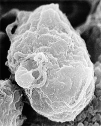
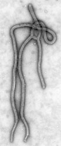
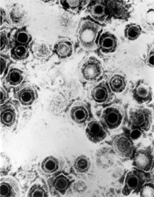

---
aliases:
  - Virus
  - Viruses
  - virus
  - is_a_virus
has_id_wikidata: Q808
code_of_nomenclature: '[[_Standards/WikiData/WD~International_Code_of_Virus_Classification_and_Nomenclature,14920640]]'
Commons_category: Viruses
Commons_gallery: Virus
confidential: public
cssclasses:
  - Type
described_by_source:
  - '[[_Standards/WikiData/WD~Q2041543,2041543]]'
  - '[[_Standards/WikiData/WD~Great_Soviet_Encyclopedia_(1926_1947),20078554]]'
  - '[[_Standards/WikiData/WD~Virus,90485223]]'
  - '[[_Standards/WikiData/WD~Dictionary_of_Common_Goods,120799836]]'
Dewey_Decimal_Classification:
  - 571.992
  - 579.2
  - 616.9101
different_from: '[[_Standards/WikiData/WD~computer_virus,485]]'
draft: false
EntitySchema_for_this_class: E170
enumerationtype: InfectiousAgentClass
expiryDate: ''
facet_of: '[[_Standards/WikiData/WD~virology,7215]]'
hashtag: virus
has_characteristic:
  - '[[_Standards/WikiData/WD~subspecies,68947]]'
  - '[[_Standards/WikiData/WD~genotype,106016]]'
  - '[[_Standards/WikiData/WD~serotype,848328]]'
  - '[[_Standards/WikiData/WD~strain,855769]]'
  - '[[_Standards/WikiData/WD~viral_life_cycle,3241872]]'
  - '[[_Standards/WikiData/WD~scientific_name,10753560]]'
  - '[[_Standards/WikiData/WD~genetic_variant,104795308]]'
  - '[[_Standards/WikiData/WD~virus_name,125481078]]'
  - '[[_Standards/WikiData/WD~isolate,125482110]]'
  - '[[_Standards/WikiData/WD~species,7432]]'
has_effect:
  - '[[_Standards/WikiData/WD~viral_infectious_disease,1928978]]'
  - '[[_Standards/WikiData/WD~viral_pneumonia,2603200]]'
has_part_s_:
  - '[[_Standards/WikiData/WD~viral_capsid,830465]]'
  - '[[_Standards/WikiData/WD~viral_genome,22329087]]'
has_use: '[[_Standards/WikiData/WD~virovory,115941943]]'
image: http://commons.wikimedia.org/wiki/Special:FilePath/Rotavirus%20Reconstruction.jpg
instance_of: '[[_Standards/WikiData/WD~taxon,16521]]'
isDeleted: false
isReadOnly: false
keywords:
  - virus
Krugosvet_article: nauka_i_tehnika/biologiya/VIRUSI.html
layout: ''
license: CC BY-SA 4.0
linkTitle: is_a_virus Class
MeSH_tree_code: B04
OmegaWiki_Defined_Meaning: 3971
parent_taxon: '[[_Standards/WikiData/WD~Biota,2382443]]'
publish: true
publishDate: ''
schematic: http://commons.wikimedia.org/wiki/Special:FilePath/Baculoviridae%20virion.jpg
spoken_text_audio: http://commons.wikimedia.org/wiki/Special:FilePath/Hy-%D5%8E%D5%AB%D6%80%D5%B8%D6%82%D5%BD%D5%B6%D5%A5%D6%80%20%28Virus%29.ogg
studied_by: '[[_Standards/WikiData/WD~virology,7215]]'
subclass_of:
  - '[[_Standards/WikiData/WD~pathogen,170065]]'
  - '[[_Standards/WikiData/WD~microorganism,39833]]'
tags:
  - class/Class
  - schema-org/Class
  - class/infectious_agent
taxon_name: Virus
taxon_rank: '[[_Standards/WikiData/WD~domain,146481]]'
title: is_a_virus Class
topic_s_main_template:
  - '[[_Standards/WikiData/WD~Template_Virus_topics,10970373]]'
  - '[[_Standards/WikiData/WD~Template_Virus_navs,14402738]]'
  - '[[_Standards/WikiData/WD~Template_Viruses,14465544]]'
type: Type
video: http://commons.wikimedia.org/wiki/Special:FilePath/Was%20sind%20Viren%20%28CC%20BY%204.0%29%20%28720p%29.webm
---

# [[Virus]] 

#is_a/bio-Domain 
#is_a :: [[../bio~Domain|bio~Domain]] 

Class of all viruses.

Tag Instances like this: 
#is_a_/virus
#is_an_/infectious_agent

[ #is_/sub_class_of :: [[../InfectiousAgentClass]] ]
[ #is_/enum_of :: [[../InfectiousAgentClass]] ]
#is_/same_as :: [[../../WikiData/WD~Virus,808]]

     

## #has_/text_of_/abstract 

> A **Virus** is a submicroscopic infectious agent 
> that replicates only inside the living cells of an organism. 
> 
> Viruses infect all life forms, from animals and plants to microorganisms, 
> including bacteria and archaea. 
> 
> Viruses are found in almost every ecosystem on Earth 
> and are the most numerous type of biological entity. 
> 
> Since Dmitri Ivanovsky's 1892 article describing a non-bacterial pathogen infecting 
> tobacco plants and the discovery of the tobacco mosaic virus by Martinus Beijerinck in 1898, 
> more than 16,000 of the millions of virus species have been described in detail.  
> The study of viruses is known as virology, a subspeciality of microbiology.
>
> When infected, a host cell is often forced to rapidly produce thousands of copies of the original virus. 
> 
> When not inside an infected cell or in the process of infecting a cell, 
> viruses exist in the form of independent viral particles, or virions, consisting of 
> - genetic material, i.e., long molecules of DNA or RNA 
>   that encode the structure of the proteins by which the virus acts; 
> - a protein coat, the capsid, which surrounds and protects the genetic material; 
> - and in some cases an outside envelope of lipids. 
> 
> The shapes of these virus particles range from simple helical and icosahedral forms 
> to more complex structures. Most virus species have virions too small to be seen 
> with an optical microscope and are one-hundredth the size of most bacteria.
>
> The origins of viruses in the evolutionary history of life are still unclear. 
> Some viruses may have evolved from plasmids, 
> which are pieces of DNA that can move between cells. 
> Other viruses may have evolved from bacteria. 
> 
> In evolution, viruses are an important means of horizontal gene transfer, 
> which increases genetic diversity in a way analogous to sexual reproduction. 
> 
> Viruses are considered by some biologists to be a life form, 
> because they carry genetic material, reproduce, and evolve through natural selection, 
> although they lack some key characteristics, such as cell structure, 
> that are generally considered necessary criteria for defining life. 
> 
> Because they possess some but not all such qualities, 
> viruses have been described as "organisms at the edge of life" and as replicators.
>
> Viruses spread in many ways. 
> One transmission pathway is through disease-bearing organisms known as vectors: 
> for example, viruses are often transmitted from plant to plant by insects that feed on plant sap, 
> such as aphids; and viruses in animals can be carried by blood-sucking insects. 
> 
> Many viruses spread in the air by coughing and sneezing, 
> including influenza viruses, SARS-CoV-2, chickenpox, smallpox, and measles. 
> 
> Norovirus and rotavirus, common causes of viral gastroenteritis, 
> are transmitted by the faecal–oral route, passed by hand-to-mouth contact or in food or water. 
> 
> The infectious dose of norovirus required to produce infection in humans 
> is fewer than 100 particles. 
> 
> HIV is one of several viruses transmitted through sexual contact 
> and by exposure to infected blood. 
> 
> The variety of host cells that a virus can infect is called its host range: 
> this is narrow for viruses specialized to infect only a few species, 
> or broad for viruses capable of infecting many.: 123–124 
>
> Viral infections in animals provoke an immune response 
> that usually eliminates the infecting virus. 
> 
> Immune responses can also be produced by vaccines, 
> which confer an artificially acquired immunity to the specific viral infection. 
> 
> Some viruses, including those that cause HIV/AIDS, HPV infection, and viral hepatitis, 
> evade these immune responses and result in chronic infections. 
> Several classes of antiviral drugs have been developed.
>
> [Wikipedia](https://en.wikipedia.org/wiki/Virus) 

## Introduction

[David P. Mindell](Viruses) 

Viruses do not fit neatly into the traditional tree of life like cellular organisms do. 

This is because viruses are not considered living organisms 
in the same sense as bacteria, archaea, protists, fungi, plants, and animals. 

Instead, viruses are typically regarded as infectious agents or biological entities 
that exist in a sort of "gray area" between living and non-living entities.

However, there are efforts to understand the evolutionary relationships and diversity of viruses 
through phylogenetic analyses of their genetic material. 

Viruses possess genetic material (either DNA or RNA) enclosed in a protein coat, 
and they can evolve through mutation, recombination, and horizontal gene transfer.

Phylogenetic analyses of viruses typically focus on comparing nucleotide 
or amino acid sequences of viral genomes 
to infer evolutionary relationships and patterns of divergence. 
This can involve constructing phylogenetic trees or networks 
that illustrate the relatedness of different viral taxa based on sequence similarity.

Despite the challenges posed by the unique biology of viruses, 
researchers have made significant progress 
in elucidating the evolutionary history and diversity of certain groups of viruses. 

For example, phylogenetic analyses have been used 
to classify viruses into various families, genera, and species 
based on shared genetic characteristics and evolutionary relationships.

Some well-studied viral groups, such as the family Herpesviridae or the family Flaviviridae, 
have established phylogenies that provide insights into their evolutionary origins, 
diversification, and adaptation to different hosts and environments.

However, it's important to note that the phylogenetic relationships of viruses can be complex 
and may not always conform to the traditional tree-like structures observed in cellular organisms. 

Viruses can undergo rapid evolution, exhibit extensive genetic diversity, 
and engage in genetic exchange with other viruses and host organisms, 
making their evolutionary histories challenging to reconstruct.

Overall, while there is ongoing research and progress in understanding the phylogeny of viruses, 
the unique biology and evolutionary dynamics of viruses present distinct challenges 
compared to cellular organisms. 

## Phylogeny 

-   « Ancestral Groups  
    -   [Tree of Life](Tree_of_Life.md)

-   ◊ Sibling Groups of  Life on Earth
    -   [Bacteria](Bacteria.md)
    -  [Eukarya](Eukarya.md) 
    -   [Archaea](Archaea)
    -   Viruses

-   » Sub-Groups

    -   [Double-stranded RNA Viruses](Virus/Double-stranded_RNA_Virus.md) (monophyly uncertain)
    -   [Single-stranded_Negative_RNA_Virus](Virus/Single-stranded_Negative_RNA_Virus.md) (monophyly uncertain)
    -   [Single-stranded_Positive_RNA_Virus](Virus/Single-stranded_Positive_RNA_Virus.md) (monophyly uncertain)
    -   [Single-stranded DNA Viruses](Virus/Single-stranded_DNA_Virus.md) (non-monophyletic)
    -   [Double-stranded DNA Viruses](Virus/Double-stranded_DNA_Virus.md) (non-monophyletic)
    -   [DNA-RNA Reverse Transcribing Viruses](DNA-RNA_Reverse_Transcribing) (monophyly uncertain) 

## Title Illustrations

---------------------------

Scientific Name ::     Lentivirus
Comments             Scanning electron micrograph of human immunodeficiency virus (HIV), grown in cultured lymphocytes. Virions are seen as small spheres on the surface of the cells.
Creator              C. Goldsmith (Center for Disease Control)
Specimen Condition   Dead Specimen
Source Collection    [Public Health Image Library](http://phil.cdc.gov/Phil/default.asp)

--------------------------------------------------------

Scientific Name ::     Ebolavirus
Comments             Transmission electron micrograph of the ebola virus, hemorrhagic fever.
Creator              C. Goldsmith (Center for Disease Control)
Specimen Condition   Dead Specimen
Source Collection    [Public Health Image Library](http://phil.cdc.gov/Phil/default.asp)

---------------------------

Scientific Name ::     Simplexvirus
Comments             Transmission electron micrograph of herpes simplex virus. Some nucleocapsids are empty, as shown by penetration of electron-dense stain.
Creator              Dr. Erskine Palmer (Center for Disease Control)
Specimen Condition   Dead Specimen
Source Collection    [Public Health Image Library](http://phil.cdc.gov/Phil/default.asp)

## Confidential Links & Embeds: 

### #is_/same_as :: [[/_Standards/bio/bio~Domain/Virus|Virus]] 

### #is_/same_as :: [[/_public/bio/bio~Domain/Virus.public|Virus.public]] 

### #is_/same_as :: [[/_internal/bio/bio~Domain/Virus.internal|Virus.internal]] 

### #is_/same_as :: [[/_protect/bio/bio~Domain/Virus.protect|Virus.protect]] 

### #is_/same_as :: [[/_private/bio/bio~Domain/Virus.private|Virus.private]] 

### #is_/same_as :: [[/_personal/bio/bio~Domain/Virus.personal|Virus.personal]] 

### #is_/same_as :: [[/_secret/bio/bio~Domain/Virus.secret|Virus.secret]] 

