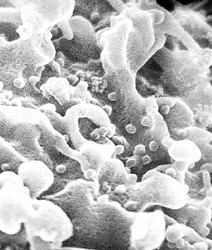

## Phylogeny 

-   « Ancestral Groups  
    -   [Virus](../Virus.md)
    -   [Tree of Life](../Tree_of_Life.md)

-   ◊ Sibling Groups of  Viruses
    -   [Double-stranded RNA         Viruses](Double-stranded_RNA_Virus.md)
    -   [Single-stranded Negative Sense RNA         Viruses](Single-stranded_Negative_Sense_RNA_Viruses)
    -   [Single-stranded Positive Sense RNA         Viruses](Single-stranded_Positive_Sense_RNA_Viruses)
    -   [Single-stranded DNA         Viruses](Single-stranded_DNA_Virus.md)
    -   [Double-stranded DNA         Viruses](Double-stranded_DNA_Virus.md)
    -   DNA-RNA Reverse Transcribing Viruses

-   » Sub-Groups 

# DNA-RNA Reverse Transcribing Viruses 

Containing group: [Virus](../Virus.md)

## Title Illustrations
  --------------------------------------------------------

  Scientific Name ::     Lentivirus
  Comments             Scanning electron micrograph of human immunodeficiency virus (HIV), grown in cultured lymphocytes. Virions are seen as small spheres on the surface of the cells.
  Creator              CDC/C. Goldsmith, P. Feorino, E. L. Palmer, W. R. McManus
  Specimen Condition   Dead Specimen
  Source Collection    [Public Health Image Library](http://phil.cdc.gov/Phil/default.asp)

## Confidential Links & Embeds: 

### #is_/same_as :: [DNA-RNA-reverse_transcribing_Virus](/_Standards/bio/bio~Domain/Virus/DNA-RNA-reverse_transcribing_Virus.md) 

### #is_/same_as :: [DNA-RNA-reverse_transcribing_Virus.public](/_public/bio/bio~Domain/Virus/DNA-RNA-reverse_transcribing_Virus.public.md) 

### #is_/same_as :: [DNA-RNA-reverse_transcribing_Virus.internal](/_internal/bio/bio~Domain/Virus/DNA-RNA-reverse_transcribing_Virus.internal.md) 

### #is_/same_as :: [DNA-RNA-reverse_transcribing_Virus.protect](/_protect/bio/bio~Domain/Virus/DNA-RNA-reverse_transcribing_Virus.protect.md) 

### #is_/same_as :: [DNA-RNA-reverse_transcribing_Virus.private](/_private/bio/bio~Domain/Virus/DNA-RNA-reverse_transcribing_Virus.private.md) 

### #is_/same_as :: [DNA-RNA-reverse_transcribing_Virus.personal](/_personal/bio/bio~Domain/Virus/DNA-RNA-reverse_transcribing_Virus.personal.md) 

### #is_/same_as :: [DNA-RNA-reverse_transcribing_Virus.secret](/_secret/bio/bio~Domain/Virus/DNA-RNA-reverse_transcribing_Virus.secret.md)

