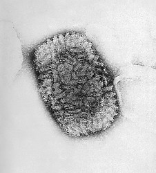

---
aliases:
  - Double-stranded_DNA_Virus
  - Double-stranded DNA Virus
title: Double-stranded DNA Viruses
---

## Phylogeny 

-   « Ancestral Groups  
    -   [Virus](../Virus.md)
    -   [Tree of Life](../Tree_of_Life.md)

-   ◊ Sibling Groups of  Viruses
    -   [Double-stranded RNA         Viruses](Double-stranded_RNA_Virus.md)
    -   [Single-stranded Negative Sense RNA         Viruses](Single-stranded_Negative_Sense_RNA_Viruses)
    -   [Single-stranded Positive Sense RNA         Viruses](Single-stranded_Positive_Sense_RNA_Viruses)
    -   [Single-stranded DNA         Viruses](Single-stranded_DNA_Virus.md)
    -   Double-stranded DNA Viruses
    -   [DNA-RNA Reverse Transcribing         Viruses](DNA-RNA_Reverse_Transcribing_Viruses)

# Double-stranded DNA Viruses 

  
Containing group: [Virus](../Virus.md)

## #has_/text_of_/abstract 

> A **DNA virus** is a virus that has a genome made of deoxyribonucleic acid (DNA) 
> that is replicated by a DNA polymerase. 
> 
> They can be divided between those that have two strands of DNA in their genome, called double-stranded DNA (dsDNA) viruses, and those that have one strand of DNA in their genome, called single-stranded DNA (ssDNA) viruses. dsDNA viruses primarily belong to two realms: Duplodnaviria and Varidnaviria, and ssDNA viruses are almost exclusively assigned to the realm Monodnaviria, which also includes some dsDNA viruses. Additionally, many DNA viruses are unassigned to higher taxa. Reverse transcribing viruses, which have a DNA genome that is replicated through an RNA intermediate by a reverse transcriptase, are classified into the kingdom Pararnavirae in the realm Riboviria.
>
> DNA viruses are ubiquitous worldwide, especially in marine environments where they form an important part of marine ecosystems, and infect both prokaryotes and eukaryotes. They appear to have multiple origins, as viruses in Monodnaviria appear to have emerged from archaeal and bacterial plasmids on multiple occasions, though the origins of Duplodnaviria and Varidnaviria are less clear.
>
> Prominent disease-causing DNA viruses include herpesviruses, papillomaviruses, and poxviruses.
>
> [Wikipedia](https://en.wikipedia.org/wiki/DNA%20virus)

## Title Illustrations

  ------------------------------------------------------------------------------------------------

  Scientific Name ::     Orthopoxvirus
  Comments             This photograph reveals smallpox virus pocks on the chorioallantoic membrane of a developing embryonic chick. Poxviruses are very easy to isolate, and will grow in a variety of cell cultures, producing characteristic hemorrhagic pocks on the embryonic chicken chorioallantoic membrane (CAM).
  Creator              CDC/John Noble
  Specimen Condition   Dead Specimen
  Source Collection    [Public Health Image Library](http://phil.cdc.gov/Phil/default.asp)
  
  ------------------------------------------------------------------------------------------------

  Scientific Name ::     Orthopoxvirus
  Comments             Electron micrograph of a Vaccinia Virus. Vaccinia virus is normally confined to cattle, but is conveyed to humans through vaccination, thereby, imparting immunity to the smallpox virus.
  Creator              CDC/Dr. Fred Murphy/Sylvia Whitfield
  Specimen Condition   Dead Specimen
  Source Collection    [Public Health Image Library](http://phil.cdc.gov/Phil/default.asp)

  

## Confidential Links & Embeds: 

### #is_/same_as :: [Double-stranded_DNA_Virus](/_Standards/bio/bio~Domain/Virus/Double-stranded_DNA_Virus.md) 

### #is_/same_as :: [Double-stranded_DNA_Virus.public](/_public/bio/bio~Domain/Virus/Double-stranded_DNA_Virus.public.md) 

### #is_/same_as :: [Double-stranded_DNA_Virus.internal](/_internal/bio/bio~Domain/Virus/Double-stranded_DNA_Virus.internal.md) 

### #is_/same_as :: [Double-stranded_DNA_Virus.protect](/_protect/bio/bio~Domain/Virus/Double-stranded_DNA_Virus.protect.md) 

### #is_/same_as :: [Double-stranded_DNA_Virus.private](/_private/bio/bio~Domain/Virus/Double-stranded_DNA_Virus.private.md) 

### #is_/same_as :: [Double-stranded_DNA_Virus.personal](/_personal/bio/bio~Domain/Virus/Double-stranded_DNA_Virus.personal.md) 

### #is_/same_as :: [Double-stranded_DNA_Virus.secret](/_secret/bio/bio~Domain/Virus/Double-stranded_DNA_Virus.secret.md)

