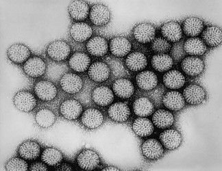

---
aliases:
- Double-stranded RNA Virus
- Double-stranded_RNA_Virus
- dsRNA
- dsRNA virus
- dsRNA-virus
- Dubultspirāles RNS vīrusi
- duop-ŝnurera ribonukleacida viruso
- Guovttesáigarat RNA-virusat
- Kaksijuosteiset RNA-virukset
- kettős szálú RNS-vírusok
- Kyevtsáigusâš RNA-viruseh
- virus ARN bicatenario
- virus d'ARN bicatenari
- Virus dsRNA
- virus z dvoverižno RNK
- virus à ARN double brin
- Vírus dsRNA
- Wiirus-Skööl 3
- Çift iplikçikli RNA virüsleri
- двРНК вируси
- двухцепочечные РНК-вирусы
- נגיפי RNA דו-גדילי
- فيروس رنا مزدوج السلاسل
- ویروسهای آرانای دورشتهای
- 二本鎖RNAウイルス
- 双链RNA病毒
- 雙股RNA病毒
- 雙鏈RNA病毒
title: Double-stranded RNA Viruses
has_id_wikidata: Q3307900
dv_has_:
  name_:
    ar: فيروس رنا مزدوج السلاسل
    bg: двРНК вируси
    ca: virus d'ARN bicatenari
    de: dsRNA
    en: double-stranded RNA virus
    eo: duop-ŝnurera ribonukleacida viruso
    es: virus ARN bicatenario
    fa: ویروسهای آرانای دورشتهای
    fi: Kaksijuosteiset RNA-virukset
    fr: virus à ARN double brin
    frr: Wiirus-Skööl 3
    he: נגיפי RNA דו-גדילי
    hu: kettős szálú RNS-vírusok
    it: dsRNA virus
    ja: 二本鎖RNAウイルス
    la: dsRNA virus
    lv: Dubultspirāles RNS vīrusi
    nl: dsRNA virus
    nn: dsRNA-virus
    pt: Vírus dsRNA
    ro: Virus dsRNA
    ru: двухцепочечные РНК-вирусы
    se: Guovttesáigarat RNA-virusat
    sl: virus z dvoverižno RNK
    smn: Kyevtsáigusâš RNA-viruseh
    tr: Çift iplikçikli RNA virüsleri
    zh: 双链RNA病毒
    zh_cn: 双链RNA病毒
    zh_hans: 双链RNA病毒
    zh_hant: 雙鏈RNA病毒
    zh_tw: 雙股RNA病毒
---
## Phylogeny 

-   « Ancestral Groups  
    -   [Virus](../Virus.md)
    -   [Tree of Life](../Tree_of_Life.md)

-   ◊ Sibling Groups of  Viruses
    -   Double-stranded RNA Viruses
    -   [Single-stranded Negative Sense RNA         Viruses](Single-stranded_Negative_Sense_RNA_Viruses)
    -   [Single-stranded Positive Sense RNA         Viruses](Single-stranded_Positive_Sense_RNA_Viruses)
    -   [Single-stranded DNA         Viruses](Single-stranded_DNA_Virus.md)
    -   [Double-stranded DNA         Viruses](Double-stranded_DNA_Virus.md)
    -   [DNA-RNA Reverse Transcribing         Viruses](DNA-RNA_Reverse_Transcribing_Viruses)

-   » Sub-Groups 

# Double-stranded RNA Viruses 

## #has_/text_of_/abstract 

> Double-stranded RNA viruses (dsRNA viruses) are a polyphyletic group of viruses that have double-stranded genomes made of ribonucleic acid. The double-stranded genome is used as a template by the viral RNA dependent RNA polymerase (RdRp) to  transcribe a positive-strand RNA functioning as messenger RNA (mRNA) for the host cell's ribosomes, which translate it into viral proteins. The positive-strand RNA can also be replicated by the RdRp to create a new double-stranded viral genome.
>
> A distinguishing feature of the dsRNA viruses is their ability to carry out transcription of the dsRNA segments within the capsid, and the required enzymes are part of the virion structure.
>
> Double-stranded RNA viruses are classified into two phyla, Duplornaviricota and Pisuviricota (specifically class Duplopiviricetes), in the kingdom Orthornavirae and realm Riboviria. The two phyla do not share a common dsRNA virus ancestor, but evolved their double strands two separate times from positive-strand RNA viruses. In the Baltimore classification system, dsRNA viruses belong to Group III.
>
> Virus group members vary widely in host range (animals, plants, fungi, and bacteria), genome segment number (one to twelve), and virion organization (T-number, capsid layers, or turrets). Double-stranded RNA viruses include the rotaviruses, known globally as a common cause of gastroenteritis in young children, and bluetongue virus, an economically significant pathogen of cattle and sheep. The family Reoviridae is the largest and most diverse dsRNA virus family in terms of host range.
>
> [Wikipedia](https://en.wikipedia.org/wiki/Double-stranded%20RNA%20viruses) 

## Title Illustrations 

  ------------------------------------------

  scientific_name ::     Rotavirus
  Comments             Transmission electron micrograph of intact rotavirus particles, double-shelled. Distinctive rim of radiating capsomeres.
  Creator              Dr. Erskine Palmer (Center for Disease Control)
  specimen_condition ::  Dead Specimen
  Source Collection    [Public Health Image Library](http://phil.cdc.gov/Phil/default.asp)

## Confidential Links & Embeds: 

### #is_/same_as :: [[/_Standards/bio/bio~Domain/Virus/Double-stranded_RNA_Virus|Double-stranded_RNA_Virus]] 

### #is_/same_as :: [[/_public/bio/bio~Domain/Virus/Double-stranded_RNA_Virus.public|Double-stranded_RNA_Virus.public]] 

### #is_/same_as :: [[/_internal/bio/bio~Domain/Virus/Double-stranded_RNA_Virus.internal|Double-stranded_RNA_Virus.internal]] 

### #is_/same_as :: [[/_protect/bio/bio~Domain/Virus/Double-stranded_RNA_Virus.protect|Double-stranded_RNA_Virus.protect]] 

### #is_/same_as :: [[/_private/bio/bio~Domain/Virus/Double-stranded_RNA_Virus.private|Double-stranded_RNA_Virus.private]] 

### #is_/same_as :: [[/_personal/bio/bio~Domain/Virus/Double-stranded_RNA_Virus.personal|Double-stranded_RNA_Virus.personal]] 

### #is_/same_as :: [[/_secret/bio/bio~Domain/Virus/Double-stranded_RNA_Virus.secret|Double-stranded_RNA_Virus.secret]] 

