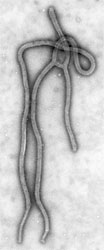

---
aliases:
  - Single-stranded_Negative_RNA_Virus
  - Single-stranded Negative RNA Virus
title: Single-stranded Negative Sense RNA Virus
---

## Phylogeny 

-   « Ancestral Groups  
    -   [Virus](../Virus.md)
    -   [Tree of Life](../Tree_of_Life.md)

-   ◊ Sibling Groups of  Viruses
    -   [Double-stranded RNA         Viruses](Double-stranded_RNA_Virus.md)
    -   Single-stranded Negative Sense RNA Viruses
    -   [Single-stranded Positive Sense RNA         Viruses](Single-stranded_Positive_Sense_RNA_Viruses)
    -   [Single-stranded DNA         Viruses](Single-stranded_DNA_Virus.md)
    -   [Double-stranded DNA         Viruses](Double-stranded_DNA_Virus.md)
    -   [DNA-RNA Reverse Transcribing         Viruses](DNA-RNA_Reverse_Transcribing_Viruses)

-   » Sub-Groups 

# Single-stranded Negative Sense RNA Viruses 

Containing group: [Virus](../Virus.md)

## Title Illustrations

  ---------------------------

  Scientific Name ::     Ebolavirus
  Comments             Transmission electron micrograph of the ebola virus, hemorrhagic fever.
  Creator              C. Goldsmith (Center for Disease Control)
  Specimen Condition   Dead Specimen
  Source Collection    [Public Health Image Library](http://phil.cdc.gov/Phil/default.asp)

---------------------------

  Scientific Name ::     Tacaribe complex (New world arenaviruses)
  Comments             Electron micrograph. Arenaviridae are RNA viruses whose particles are spherical and have an average diameter of 110-130 nanometers. Arenaviridae members are zoonotic, which means that in nature they are found in reservoir animal hosts.
  Creator              Center for Disease Control
  Specimen Condition   Dead Specimen
  Source Collection    [Public Health Image Library](http://phil.cdc.gov/Phil/default.asp)

## Confidential Links & Embeds: 

### #is_/same_as :: [[/_Standards/bio/bio~Domain/Virus/Single-stranded_Negative_RNA_Virus|Single-stranded_Negative_RNA_Virus]] 

### #is_/same_as :: [[/_public/bio/bio~Domain/Virus/Single-stranded_Negative_RNA_Virus.public|Single-stranded_Negative_RNA_Virus.public]] 

### #is_/same_as :: [[/_internal/bio/bio~Domain/Virus/Single-stranded_Negative_RNA_Virus.internal|Single-stranded_Negative_RNA_Virus.internal]] 

### #is_/same_as :: [[/_protect/bio/bio~Domain/Virus/Single-stranded_Negative_RNA_Virus.protect|Single-stranded_Negative_RNA_Virus.protect]] 

### #is_/same_as :: [[/_private/bio/bio~Domain/Virus/Single-stranded_Negative_RNA_Virus.private|Single-stranded_Negative_RNA_Virus.private]] 

### #is_/same_as :: [[/_personal/bio/bio~Domain/Virus/Single-stranded_Negative_RNA_Virus.personal|Single-stranded_Negative_RNA_Virus.personal]] 

### #is_/same_as :: [[/_secret/bio/bio~Domain/Virus/Single-stranded_Negative_RNA_Virus.secret|Single-stranded_Negative_RNA_Virus.secret]] 

