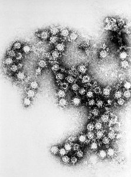
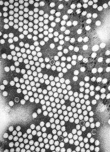

---
aliases:
  - Single-stranded_Positive_RNA_Virus
  - Single-stranded Positive RNA Virus
title: Single-stranded Positive Sense RNA Virus
---

## Phylogeny 

-   « Ancestral Groups  
    -   [Virus](../Virus.md)
    -   [Tree of Life](../Tree_of_Life.md)

-   ◊ Sibling Groups of  Viruses
    -   [Double-stranded RNA         Viruses](Double-stranded_RNA_Virus.md)
    -   [Single-stranded Negative Sense RNA         Viruses](Single-stranded_Negative_Sense_RNA_Viruses)
    -   Single-stranded Positive Sense RNA Viruses
    -   [Single-stranded DNA         Viruses](Single-stranded_DNA_Virus.md)
    -   [Double-stranded DNA         Viruses](Double-stranded_DNA_Virus.md)
    -   [DNA-RNA Reverse Transcribing         Viruses](DNA-RNA_Reverse_Transcribing_Viruses)

-   » Sub-Groups 

# Single-stranded Positive Sense RNA Viruses 

## Title Illustrations

--------------------------------------------

  Scientific Name ::     Coxsackie B4 virus
  Comments             Using immunoelectron microscopic technique, one is able to discern the morphologic traits of the Coxsackie B4 virus virions.
  Creator              Center for Disease Control
  Specimen Condition   Dead Specimen
  Source Collection    [Public Health Image Library](http://phil.cdc.gov/Phil/default.asp)

--------------------------------------------

  Scientific Name ::     Poliovirus
  Comments             Electron micrograph of the poliovirus.
  Creator              Dr. Fred Murphy, Sylvia Whitfield, Center for Disease Control
  Specimen Condition   Dead Specimen
  Source Collection    [Public Health Image Library](http://phil.cdc.gov/Phil/default.asp)

## Confidential Links & Embeds: 

### #is_/same_as :: [[/_Standards/bio/bio~Domain/Virus/Single-stranded_Positive_RNA_Virus|Single-stranded_Positive_RNA_Virus]] 

### #is_/same_as :: [[/_public/bio/bio~Domain/Virus/Single-stranded_Positive_RNA_Virus.public|Single-stranded_Positive_RNA_Virus.public]] 

### #is_/same_as :: [[/_internal/bio/bio~Domain/Virus/Single-stranded_Positive_RNA_Virus.internal|Single-stranded_Positive_RNA_Virus.internal]] 

### #is_/same_as :: [[/_protect/bio/bio~Domain/Virus/Single-stranded_Positive_RNA_Virus.protect|Single-stranded_Positive_RNA_Virus.protect]] 

### #is_/same_as :: [[/_private/bio/bio~Domain/Virus/Single-stranded_Positive_RNA_Virus.private|Single-stranded_Positive_RNA_Virus.private]] 

### #is_/same_as :: [[/_personal/bio/bio~Domain/Virus/Single-stranded_Positive_RNA_Virus.personal|Single-stranded_Positive_RNA_Virus.personal]] 

### #is_/same_as :: [[/_secret/bio/bio~Domain/Virus/Single-stranded_Positive_RNA_Virus.secret|Single-stranded_Positive_RNA_Virus.secret]] 

